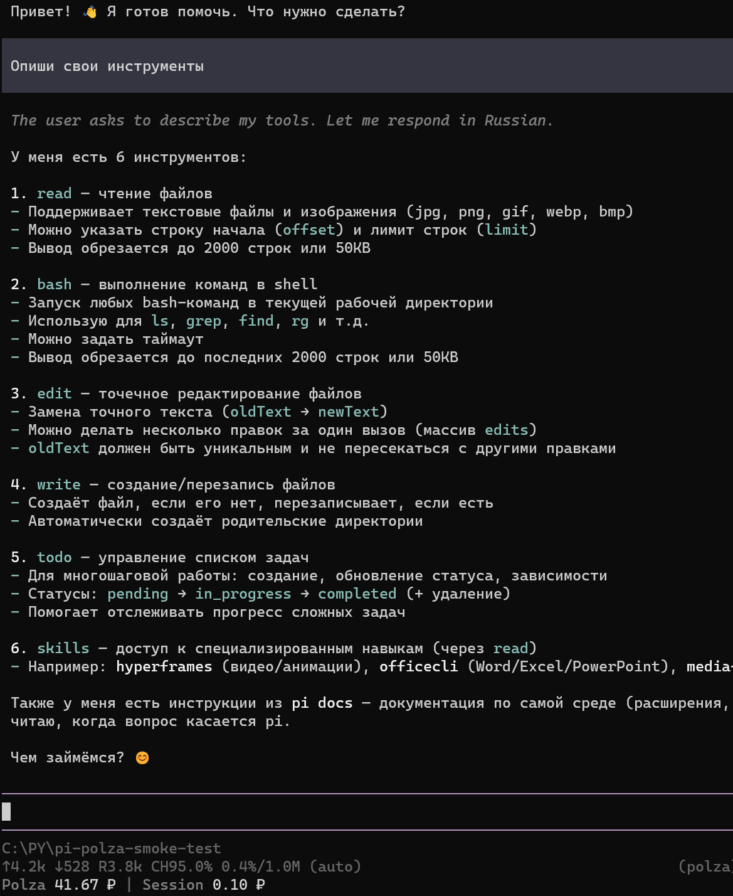
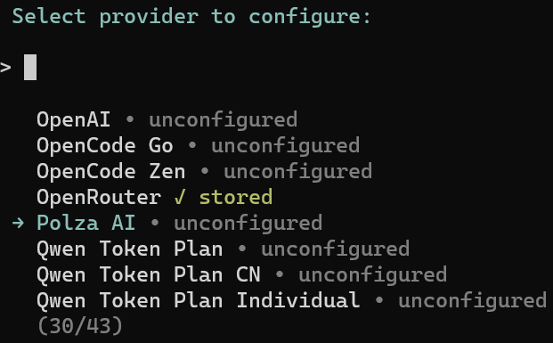
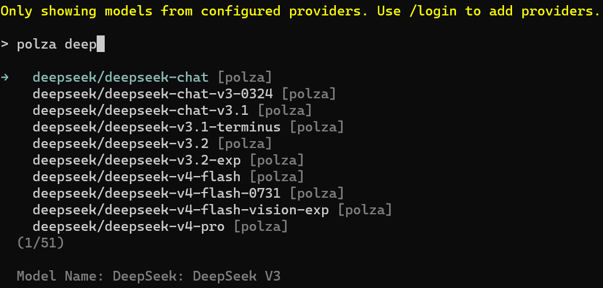
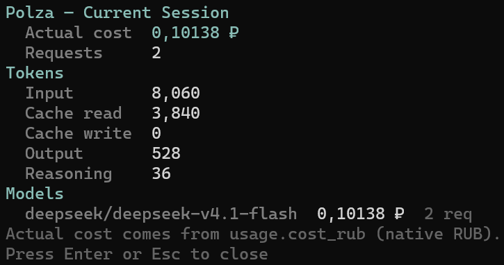
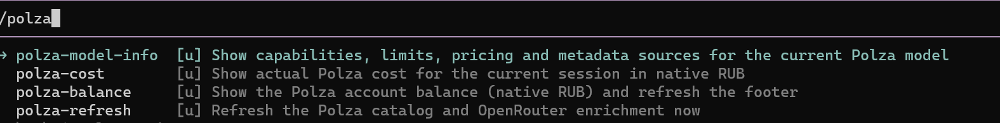
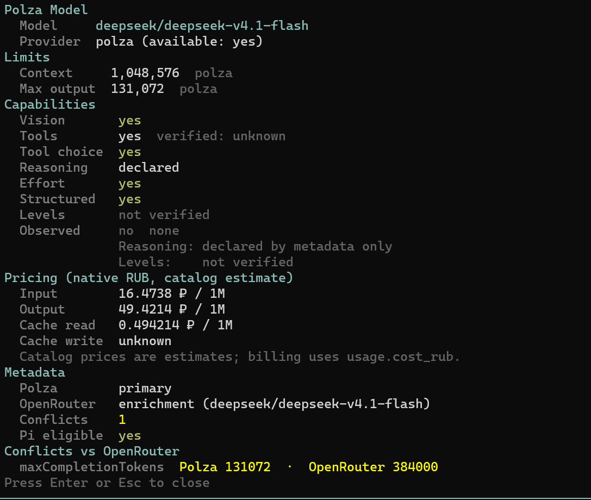
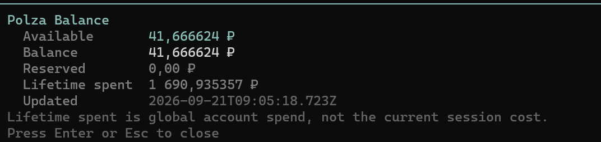

# pi-polza

Русский · [English](README.en.md)

**Polza AI как нативный динамический провайдер моделей для [Pi Agent](https://pi.dev) — сотни моделей, нативный вход через Pi и реальный учёт расходов в рублях.**

`pi-polza` подключает [Polza AI](https://polza.ai) к Pi как настоящий провайдер моделей. Установите
один раз, войдите в Polza по API-ключу прямо в Pi, выберите модель и работайте как обычно. Плагин сам
обнаруживает доступные модели и их возможности, а расходы Polza в рублях отслеживает прямо в футере
Pi.



## Зачем это нужно

Polza предоставляет OpenAI-совместимый endpoint, но обычный endpoint ничего не сообщает Pi о том,
*какие* модели существуют, каковы их лимиты и сколько на самом деле стоил запрос. Этот плагин
закрывает пробел:

- каталог **обнаруживается во время работы**, а не прописан жёстко;
- авторизация — **нативный Pi `/login`**, поэтому ключ лежит в штатном хранилище Pi;
- деньги учитываются в **рублях** — валюте, в которой Polza реально выставляет счёт.

## Возможности

- Динамический каталог моделей Polza (загружается на старте, обновляется на месте)
- Нативная авторизация Pi через `/login` — конфигурационные файлы не нужны
- Сотни совместимых LLM у одного провайдера
- Лимиты контекстного окна и максимальной длины вывода
- Метаданные зрения / инструментов / reasoning с честным `unknown`
- Обогащение метаданных из OpenRouter (лимиты, модальности, возможности)
- Учёт фактического `usage.cost_rub` — числа самой Polza, а не оценки
- Учёт расходов подагентов: foreground — автоматически, background — по завершении запуска
- Баланс аккаунта и стоимость сессии в футере Pi
- Потоковые ответы и вызов инструментов
- Четыре слэш-команды для просмотра моделей, расходов и баланса

## Установка

Требуется [Pi Agent](https://pi.dev) и Node.js ≥ 22.6.

```bash
pi install https://github.com/VladimirMonin/pi-polza
```

Если предпочитаете зафиксировать релиз:

```bash
pi install https://github.com/VladimirMonin/pi-polza@v0.2.0
```

Проверить установку:

```bash
pi list
```

## Авторизация

Запустите Pi и выполните `/login`:

```
/login
```

1. Выберите **Polza AI**.
2. Выберите **Sign in with an API key**.
3. Вставьте свой API-ключ Polza.



Ключ сохраняет сам Pi (там же, где и для остальных провайдеров), и он используется для каталога
моделей, запросов чата и запросов баланса. Файл `.env` не нужен.

> Если список моделей после входа пуст, выполните `/polza-refresh`, чтобы перезагрузить каталог.

### Для продвинутых: окружение / headless / CI

Для headless- и CI-сценариев ключ можно передать через окружение вместо `/login`:

| Переменная | Значение |
| --- | --- |
| `POLZA_API_KEY` | Сам ключ. |
| `PI_POLZA_ENV_FILE` | Путь к конкретному файлу `.env`, который нужно прочитать. |

Иначе читается `.env` в том проекте, из которого вы запускаете Pi:

```dotenv
POLZA_API_KEY=<ваш-ключ>
```

Сохранённые учётные данные Pi всегда имеют приоритет; окружение учитывается только тогда, когда
ничего не сохранено.

## Быстрый старт

```
/login            → Polza AI → Sign in with an API key
/model            → поиск "polza" → выберите любую модель
<задайте вопрос>
```



## Модели

Каталог загружается из Polza при старте и кэшируется. Для чата доступно около **285 моделей** из
~398 записей каталога; остальные отфильтрованы, потому что не являются пригодными чат-моделями либо
их лимиты не удаётся определить надёжно (см. [Известные ограничения](#известные-ограничения)).

`/polza-refresh` перезагружает каталог и обогащение из OpenRouter без перезапуска Pi.

## Учёт расходов в рублях

Polza выставляет счёт в рублях, а встроенное поле стоимости Pi номинировано в долларах. Поэтому
`pi-polza` ведёт нативный учёт в рублях **отдельно** от долларового `cost` в Pi:

| Источник | Для чего используется |
| --- | --- |
| Цены из каталога | Справочная оценка (₽ за 1 млн токенов) |
| `usage.cost_rub` | **Фактическая** сумма, которую Polza списала за запрос |
| `GET /api/v2/balance` | Баланс аккаунта |

Стоимость сессии накапливается из значения `cost_rub`, которое Polza возвращает на каждый запрос, —
включая потоковые, которые перехватываются инкрементально, а не буферизуются. Она сохраняется между
перезапусками.

> Плагин **не** оценивает фактические расходы сессии по ценам за токены. Он записывает собственное
> значение `usage.cost_rub`, возвращённое Polza на каждый запрос. Цены из каталога показываются
> только как ориентир.



Стандартное долларовое поле `cost` в Pi намеренно оставлено равным `0` — нативные рублёвые числа в
него никогда не записываются.

## Подагенты и фоновые задачи

Pi умеет запускать подагентов (например, через `pi-subagents`). `pi-polza` учитывает их расходы
отдельно от основной сессии:

| Тип подагента | Как учитывается |
| --- | --- |
| Foreground | Автоматически: он наследует провайдер родителя, и его запросы попадают в основную сессию как обычно. |
| Background | По завершении: он работает в отдельном процессе со своим экземпляром `pi-polza`, поэтому его расходы импортируются в основную сессию, когда запуск завершён. |

**Что считается.** Только реальные ответы Polza с `usage.cost_rub`: запросы основной сессии,
foreground-подагентов и завершённых background-подагентов. Это единственный источник сумм.

**Когда обновляется.** Основная сессия и foreground — по каждому завершённому запросу; background —
после завершения запуска. Пока фоновый запуск ещё идёт, его расходы могут быть ещё не включены — это
честное состояние, а не ноль.

**Что не считается.** Другие провайдеры (Anthropic, OpenAI и т. п.); независимые сессии других
пользователей или пиров, даже если они используют тот же аккаунт Polza; внешние API-клиенты,
которые обращаются к Polza в обход `pi-polza`. Чужие расходы не переводятся в рубли и **никогда не
показываются как `0 ₽`** — они просто исключены из отчёта.

**Где смотреть.** Футер Pi (`Polza <баланс> ₽ | Spent <расход> ₽`) и `/polza-cost`. Команда
`/polza-balance` показывает **баланс всего кошелька аккаунта**, а не стоимость сессии: баланс
меняется и от других сессий и приложений, поэтому его разница не является мерой расходов одного
запуска.

**Ограничение разбивки.** Для foreground-подагентов указывается только сумма, без имени агента.
Их запросы неотличимы от запросов самого main (особенно при совпадающих моделях и параллельных
детях), поэтому плагин не угадывает владельца. В `/polza-cost` они входят в `Root session` —
сумма верна, attribution нет.

**Если данных не хватает.** При неполных данных футер добавляет пометку `partial`, а в
`/polza-cost` появляется секция `Coverage` со счётчиками запросов с известной и неизвестной
стоимостью. Неизвестная стоимость остаётся неизвестной и никогда не превращается в `0 ₽`.

> Интеграция с `pi-subagents` **опциональна**. Если пакет не установлен, `pi-polza` работает
> как обычно: ничего не обнаруживается, ошибок не показывается.

## Команды

| Команда | Описание |
| --- | --- |
| `/polza-model-info` | Возможности, лимиты, цены и источники метаданных для текущей модели |
| `/polza-cost` | Фактические расходы Polza: основная сессия, foreground- и завершённые background-подагенты |
| `/polza-balance` | Баланс аккаунта Polza (нативные рубли) и обновление футера |
| `/polza-refresh` | Перезагрузить каталог Polza и обогащение из OpenRouter |

### Что показывает `/polza-cost`

Отчёт разделён на секции:

- **Root session** — расходы основной сессии и foreground-подагентов (сумма верна, разбивки по
  агентам нет);
- **Background subagents** — завершённые фоновые подагенты, сгруппированные по имени агента и
  модели, как их сообщило окружение запуска;
- **Tokens** и **Models** — разбивка токенов и расходов по моделям;
- **Coverage** — сколько запросов имеют известную стоимость, а сколько нет, и признак
  `complete` / `partial`;
- **Not included** — чужие провайдеры, явно исключённые из рублёвого учёта.

<details>
<summary>Скриншоты команд</summary>

**Список команд**



**`/polza-model-info`**



**`/polza-balance`**



</details>

## Метаданные моделей

Метаданные собираются из нескольких источников в порядке приоритета:

1. **Polza** — основной источник истины (модель существует и тарифицируется).
2. **OpenRouter** — только обогащение: лимиты, модальности и возможности, если Polza их не указала.
   Сопоставление по точному id модели; догадки исключены.
3. **Проверенный override** — редкая явная правка, подтверждённая живым экспериментом.
4. **`unknown`** — когда ни один из источников не даёт достоверного значения.

Из-за этого поля могут показывать `unknown` или `not verified`. Это означает, что **надёжного
подтверждения нет**, а не что плагин сломался. Плагин никогда не придумывает возможности, чтобы
заполнить пробел: отсутствующее значение остаётся `unknown`, а не `0`.

<details>
<summary>Скриншот: детали метаданных</summary>


</details>

## Обогащение из OpenRouter

Публичный список моделей OpenRouter используется, чтобы заполнить пробелы в лимитах, модальностях и
возможностях. Он применяется строго как обогащение:

- сопоставление только по **точному id модели**;
- значение Polza всегда важнее значения OpenRouter;
- расхождения фиксируются как **конфликты** и показываются в `/polza-model-info`;
- результаты кэшируются на диске (`.pi/pi-polza-cache/`) и переиспользуются офлайн, поэтому медленный
  или недоступный OpenRouter никогда не блокирует старт.

## Известные ограничения

- Уровни reasoning (`minimal`/`low`/`medium`/`high`/…) подтверждены не для всех семейств моделей;
  в панели указывается `not verified` там, где нет воспроизводимых доказательств.
- Часть моделей, эксклюзивных для Polza, опущена, когда обязательные для Pi лимиты не удаётся
  определить надёжно — лучше отсутствовать, чем ошибаться.
- Метаданные каталога и фактически списанная сумма могут расходиться. Тарификация всегда следует
  `usage.cost_rub`.
- Стандартное долларовое поле `cost` в Pi не используется для нативного учёта в рублях.
- Полнота метаданных различается по моделям: не у всех одинаково богатая информация.
- Для foreground-подагентов нет разбивки по именам агентов: их расходы входят в общую сумму
  основной сессии, потому что неотличимы от запросов самого main.
- Импорт расходов background-подагентов проверен офлайн-тестами; полный live-прогон с фоновыми
  подагентами в реальном окружении Pi остаётся за рамками этой версии.

## Обновление

```bash
pi update --extensions          # обновить все установленные пакеты
pi update --extension pi-polza  # обновить только этот (для npm-установок)
```

Установки из Git, зафиксированные на теге, сдвигаются только при установке нового ref:

```bash
pi install https://github.com/VladimirMonin/pi-polza@v0.2.0
```

## Удаление

```bash
pi remove https://github.com/VladimirMonin/pi-polza
```

Это удаляет пакет из настроек Pi. Сохранённые учётные данные Polza удаляются отдельно через `/login`
(или средствами управления учётными данными Pi).

## Разработка

```bash
npm test            # офлайн-юнит-тесты
npm run test:live   # live-тесты (нужен ключ; тратит небольшую сумму)
npm run probe:catalog
npm run probe:balance
npm run probe:chat
npm run probe:startup
npm run audit:secrets
```

Структура репозитория:

- `.pi/extensions/pi-polza/` — расширение: рабочий код и общие модули
- `scripts/` — отдельные диагностические probe-скрипты
- `tests/`, `tests-live/` — офлайн- и live-тесты
- `notes/` — инженерные заметки и результаты живых экспериментов
- `instructions/manual-testing.md` — как подготовить и провести приёмочный тест установки
- `instructions/commit-and-release-guide.md` — конвенции коммитов, тегов и релизов

## Безопасность

- `POLZA_API_KEY` никогда не логируется — ни в stdout/stderr, ни в трейсы, журналы сессий или ошибки.
- Заголовок `Authorization` удаляется перед любым HTTP-логированием.
- `.env` добавлен в `.gitignore`; `.env.example` показывает ожидаемый формат.
- Плагин не хранит собственных учётных данных — используется нативное хранилище Pi.
- `npm run audit:secrets` сканирует рабочее дерево и историю Git на утечки секретов.

## Лицензия

[MIT](LICENSE)
