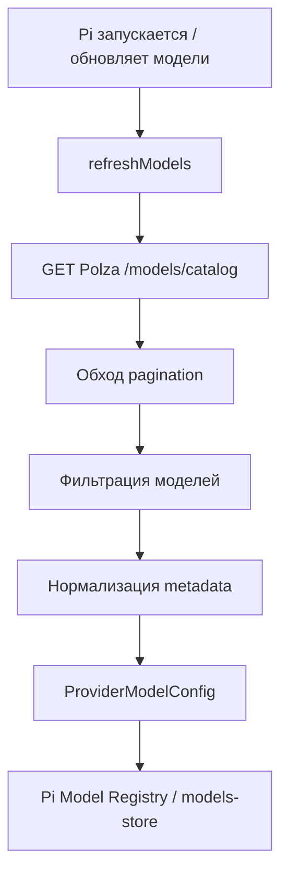
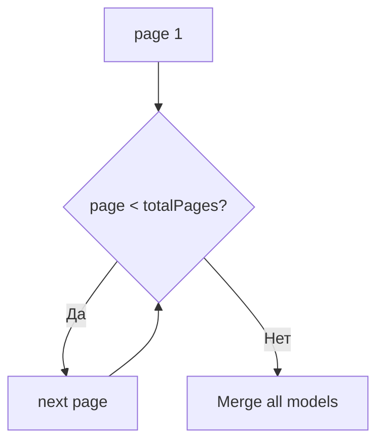
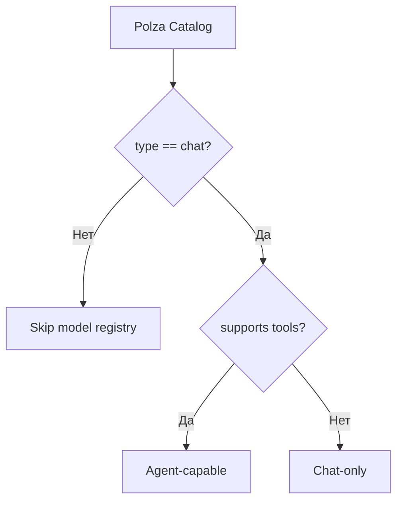
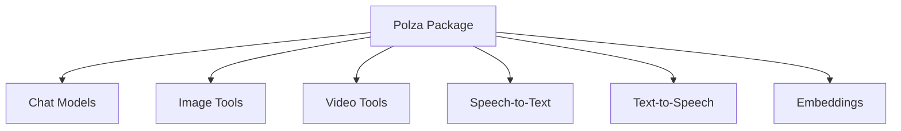
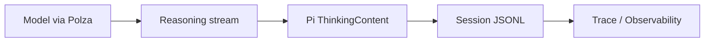
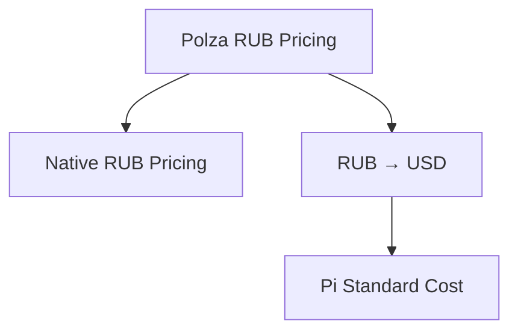
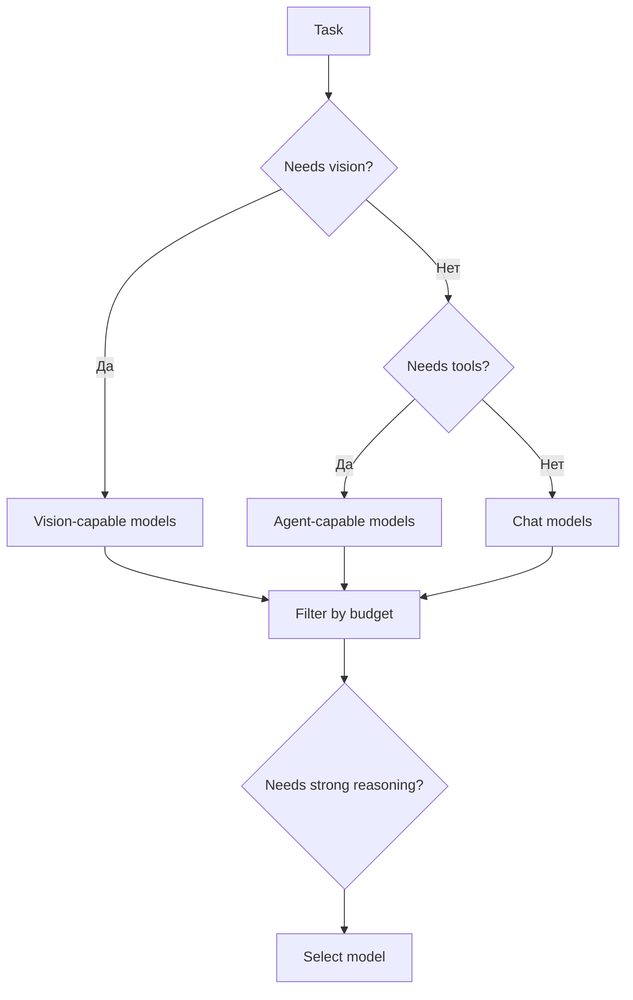
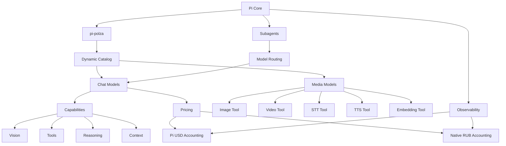

# Polza AI как полноценный Custom Provider для Pi Agent 🔌

## Зачем рассматривать Polza не просто как OpenAI-compatible endpoint 🧭

Polza AI можно подключить к Pi самым простым способом: указать OpenAI-compatible endpoint, API-ключ и вручную прописать нужные модели.

Но возможности Pi и каталог Polza позволяют пойти значительно дальше.

Вместо статического подключения нескольких моделей можно построить полноценный provider package, который автоматически:

- загружает актуальный каталог моделей Polza;
- фильтрует модели по типу и совместимости с agent workflow;
- определяет context window;
- определяет max output;
- определяет text/vision capabilities;
- определяет reasoning support;
- определяет поддержку tool calling;
- получает цены input/output;
- получает цены cache read/cache write;
- сохраняет нативные цены Polza в RUB;
- отдаёт Pi цены в формате, который понимает стандартный usage/cost layer;
- автоматически подхватывает новые модели;
- подключает image/video/audio/embeddings как отдельные Tools.

В итоге Polza можно превратить не просто в источник API-запросов, а в **полноценный динамический model provider для Pi**.

---

# Базовая архитектура 🧩

```mermaid
flowchart TD
    P[Pi Agent] --> EXT[pi-polza Extension]
    EXT --> API[Polza API]

    API --> CAT[/models/catalog]
    CAT --> MAP[Capability / Pricing Mapper]
    MAP --> REG[Pi Model Registry]

    API --> CHAT[Chat Completions]
    CHAT --> P

    API --> MEDIA[Media endpoints]
    MEDIA --> TOOLS[Pi Tools]
```

Итоговый пакет может объединять:

```text
Provider
+
Dynamic Model Catalog
+
Capability Detection
+
Pricing
+
Media Tools
+
Usage UI
```

---

# Polza как OpenAI-compatible provider ✅

Polza предоставляет OpenAI-compatible API.

Базовая схема:

```text
https://polza.ai/api/v1
```

Поэтому Pi может использовать стандартный OpenAI-compatible transport для chat-моделей.

Минимальный вариант подключения:

```text
Pi
↓
OpenAI-compatible transport
↓
Polza
↓
Model
```

Для простого курса этого достаточно, чтобы показать:

```text
baseUrl
apiKey
model id
```

Но ручной `models.json` плохо масштабируется, если доступно несколько сотен моделей.

---

# Dynamic Provider через Extension API 🚀

Pi позволяет Extension регистрировать собственных model providers.

Для динамического каталога особенно важен механизм:

```text
refreshModels()
```

Он позволяет provider-у самостоятельно получать актуальный список моделей.

Концептуальная схема:



Это лучше, чем вручную обновлять `models.json`.

---

# Каталог Polza 📚

Для богатого каталога моделей используется endpoint:

```text
GET /api/v1/models/catalog
```

Ответ содержит не только ID и название модели, но и расширенные metadata.

Среди подтверждённых полей:

```text
id
name
type

architecture:
    input_modalities
    output_modalities

top_provider:
    context_length
    max_completion_tokens

    pricing:
        prompt_per_million
        completion_per_million
        input_cache_read_per_million
        input_cache_write_per_million
        currency

    supported_parameters:
        reasoning
        include_reasoning
        reasoning_effort
        tools
        tool_choice
        structured_outputs
        response_format
        ...
```

---

# Pagination каталога 📄

Каталог Polza пагинирован.

Ответ содержит значения вида:

```text
page
limit
total
totalPages
```

Поэтому provider не должен ограничиваться одним вызовом.

Неправильно:

```text
GET /models/catalog
↓
получили 20 моделей
↓
готово
```

Правильно:



Provider должен проходить все страницы до `totalPages`.

---

# Фильтрация моделей 🧹

Каталог Polza содержит не только chat-модели.

В нём могут встречаться:

```text
chat
image
video
stt
tts
embeddings
...
```

Поэтому `/model` Pi не должен превращаться в склад вообще всего API.

Для Pi Model Registry разумно брать:

```text
type == chat
```

и дополнительно проверять совместимость с Chat Completions.

---

# Agent-capable модели 🛠️

Не каждая chat-модель обязательно подходит для полноценной агентной работы.

Для Pi особенно важна поддержка:

```text
tools
tool_choice
```

Поэтому можно добавить дополнительный режим фильтрации:

```text
All Chat Models
```

или:

```text
Agent-capable Models Only
```

Логика:



Настройка может выглядеть концептуально так:

```text
showNonToolModels = false
```

По умолчанию пользователь видит только модели, которые подходят для agent loop.

---

# Mapping Polza → Pi 🔄

Большая часть metadata мапится почти напрямую.

| Polza | Pi | Статус |
|---|---|---|
| `id` | `id` | ✅ |
| `name` | `name` | ✅ |
| `context_length` | `contextWindow` | ✅ |
| `max_completion_tokens` | `maxTokens` | ✅ |
| `input_modalities: text` | `input: ["text"]` | ✅ |
| `input_modalities: image` | добавить `"image"` | ✅ |
| reasoning metadata | `reasoning: true` | ✅ |
| `reasoning_effort` | thinking levels | ✅ с compatibility mapping |
| `tools` | agent-capable | ✅ |
| `prompt_per_million` | `cost.input` | ⚠ currency conversion |
| `completion_per_million` | `cost.output` | ⚠ currency conversion |
| cache read price | `cost.cacheRead` | ⚠ currency conversion |
| cache write price | `cost.cacheWrite` | ⚠ currency conversion |
| `file` | model input | ❌ Pi schema не поддерживает |
| `video` | model input | ❌ Pi schema не поддерживает |
| media generation models | Pi model registry | ❌ лучше Tool |

---

# Context Window и Max Output 📐

Polza публикует:

```text
context_length
max_completion_tokens
```

Они могут напрямую использоваться для:

```text
contextWindow
maxTokens
```

Это позволяет Pi корректно:

- оценивать заполнение контекста;
- рассчитывать compaction thresholds;
- показывать context usage;
- ограничивать output;
- отображать capabilities конкретной модели.

---

# Vision / Multimodality 👁️

Polza сообщает входные modalities.

Например:

```text
text
image
file
video
```

Pi в model metadata нативно понимает:

```text
text
image
```

Поэтому mapping должен быть консервативным:

```text
text
→ Pi text

image
→ Pi image

file
→ отдельный Tool / preprocessing layer

video
→ отдельный Tool

audio
→ отдельный Tool
```

---

# Почему file/video/audio не стоит притворять обычными model modalities 🎬

Pi model schema не предназначена для всех типов media input.

Поэтому правильнее разделить:

```text
LLM capabilities
```

и:

```text
Media capabilities
```

Например:



---

# Reasoning Support 🧠

Polza catalog умеет сообщать:

```text
reasoning
include_reasoning
reasoning_effort
```

Это позволяет автоматически определять, что модель относится к reasoning-capable.

Базовая логика:

```text
reasoning / reasoning_effort detected
↓
reasoning = true
```

---

# Thinking Levels ⚙️

Наличие `reasoning_effort` ещё не означает, что каждая модель поддерживает одинаковый набор уровней.

Возможные значения у разных provider/model family могут различаться:

```text
minimal
low
medium
high
xhigh
max
```

Поэтому provider должен иметь compatibility mapping.

Например:

```text
GPT family
→ map A

Claude family
→ map B

Gemini family
→ map C

Qwen family
→ map D

DeepSeek family
→ map E
```

Для неизвестной модели лучше использовать консервативное поведение.

> [!warning]
> Нельзя автоматически считать, что если модель принимает `reasoning_effort`, она обязательно понимает все уровни Pi.

---

# Reasoning в session trace 🔬

Pi OpenAI-compatible transport умеет распознавать несколько вариантов reasoning payload:

```text
reasoning_content
reasoning
reasoning_text
reasoning_details
```

и преобразовывать их в Pi thinking blocks.

Поэтому возможна цепочка:



Это особенно важно для курса, где reasoning рассматривается как полезный артефакт анализа поведения агента.

> [!note]
> Фактическое поведение нужно отдельно протестировать на нескольких семействах моделей, потому что агрегатор может нормализовывать reasoning разных provider-ов по-разному.

---

# Pricing 💰

Polza публикует цены на уровне model metadata.

Подтверждённые поля:

```text
prompt_per_million
completion_per_million
input_cache_read_per_million
input_cache_write_per_million
currency
```

Главный нюанс:

```text
Polza → RUB
Pi cost → USD per million tokens
```

Это означает, что нативные цены Polza нельзя напрямую помещать в `cost` Pi.

---

# Почему RUB нельзя просто положить в `cost` Pi ⚠️

Например:

```text
Polza:
output = 135 RUB / 1M
```

Если записать:

```text
cost.output = 135
```

Pi будет трактовать это как:

```text
$135 / 1M
```

и usage/cost станет неверным.

---

# Двойной accounting 💳

Оптимальная архитектура:



### Стандартный Pi cost

Используется для совместимости:

```text
usage.cost
trace
subagent accounting
standard status UI
```

Цена Polza переводится из RUB в USD.

### Native Polza cost

Расширение отдельно хранит оригинальные цены:

```text
promptRUB
completionRUB
cacheReadRUB
cacheWriteRUB
```

И собственный dashboard показывает стоимость непосредственно в рублях.

---

# Estimated Cost vs Actual Billing 📊

Каталог Polza публикует pricing внутри:

```text
top_provider
```

Поэтому эту цену разумно считать **актуальной оценкой preferred route**, а не абсолютной гарантией того, что любой запрос будет выставлен именно по этой цене.

Polza может использовать routing/fallback между провайдерами.

Следовательно интерфейс желательно разделить:

```text
Estimated cost
```

и:

```text
Actual billed cost
```

если runtime API Polza позволит получить точную стоимость запроса.

---

# Cache Pricing 🗄️

Каталог Polza действительно может публиковать:

```text
input_cache_read_per_million
input_cache_write_per_million
```

Это хорошо соответствует Pi:

```text
cost.cacheRead
cost.cacheWrite
```

Mapping:

```text
Polza cache read
→ Pi cacheRead

Polza cache write
→ Pi cacheWrite
```

Если цена не указана:

```text
unknown
```

а не вычисляется самостоятельно.

---

# Cache Runtime Usage 🧪

Отдельно нужно различать:

```text
цена cache
```

и:

```text
реальное количество cached tokens в конкретном запросе
```

Каталог подтверждает **pricing**.

Но реальный runtime response Polza необходимо протестировать, чтобы убедиться, что он передаёт cache token counters в формате, который Pi корректно распознаёт.

Это один из обязательных integration tests.

---

# Prompt Cache TTL ⏱️

Pi умеет отдельно описывать параметры prompt cache lifetime.

Это не то же самое, что стоимость.

Нужно различать:

```text
cache read price
cache write price
cache TTL
```

Это три разных свойства.

Если Polza/конкретный upstream provider публикует TTL или имеет стабильную документированную политику, её можно добавить в model metadata.

Если нет — не стоит угадывать.

---

# Media Tools 🎨

Вместо попытки запихнуть все Polza capabilities в model registry лучше построить отдельные Pi Tools.

Пример будущего пакета:

```text
polza_image_generate
polza_video_generate
polza_transcribe
polza_speech
polza_embed
```

---

# Image Generation 🖼️

Image-модели Polza лучше показывать не в `/model`, а через отдельный Tool.

```text
Agent
↓
polza_image_generate
↓
Polza Image API
↓
Artifact
```

Так модель сама понимает, что генерация изображения — действие, а не смена основной LLM.

---

# Video Generation 🎬

Видео может иметь собственную pricing model, например:

```text
video_per_second
```

Поэтому video-generation Tool должен иметь собственный usage/cost accounting.

---

# Speech-to-Text 🎙️

Для STT встречается отдельная ценовая логика:

```text
stt_per_minute
```

Такой Tool можно использовать для:

- транскрибации лекций;
- обработки аудио;
- подготовки материала для дальнейшей работы агента.

---

# Text-to-Speech 🔊

TTS также должен быть отдельным capability/tool layer.

Это позволяет не смешивать:

```text
LLM selection
```

и:

```text
media generation
```

---

# Embeddings 🧬

Embedding-модели логично регистрировать как отдельный Tool или специализированный subsystem.

Пример:

```text
polza_embed
```

Он может использоваться для:

- semantic search;
- memory;
- RAG;
- similarity;
- indexing.

---

# Возможная структура `pi-polza` package 📦

```text
pi-polza/
│
├── provider/
│   ├── auth
│   ├── chat transport
│   ├── refreshModels
│   ├── catalog pagination
│   ├── capability mapper
│   └── compatibility rules
│
├── pricing/
│   ├── RUB prices
│   ├── USD conversion
│   ├── cache pricing
│   └── runtime usage
│
├── tools/
│   ├── image
│   ├── video
│   ├── stt
│   ├── tts
│   └── embeddings
│
├── ui/
│   ├── model info
│   ├── balance
│   ├── cost
│   └── refresh
│
└── settings/
    ├── filtering
    ├── agent-only models
    ├── currency
    └── compatibility overrides
```

---

# Возможные команды TUI 🖥️

## `/polza-model-info`

Показывает:

```text
Model
Provider
Context
Max output
Vision
Tools
Reasoning
Thinking levels
Input price
Output price
Cache read
Cache write
```

---

## `/polza-refresh`

Принудительно обновляет dynamic catalog.

Хотя Pi уже имеет собственный механизм обновления моделей, отдельная команда может быть удобна для диагностики.

---

## `/polza-balance`

Если Polza API предоставляет balance endpoint, можно отображать:

```text
Current balance
Today spend
Session spend
```

---

## `/polza-cost`

Показывает нативную стоимость сессии в RUB.

Пример:

```text
Main Agent        84.30 ₽
Researcher        12.41 ₽
Reviewer          19.82 ₽
────────────────────────
Session          116.53 ₽
```

---

# Использование с Subagents 🤖

Polza особенно интересна вместе с `pi-subagents`.

Один API-ключ может давать доступ к разным модельным семействам.

Например:

```text
Main
→ strong reasoning model

Scout
→ cheap fast model

Researcher
→ Gemini-class model

Worker
→ coding model

Reviewer
→ strong reasoning model
```

Все роли работают через:

```text
ONE PROVIDER
ONE API KEY
ONE BALANCE
```

Это хорошо подходит для обучения model routing.

---

# Профили стоимости 🎛️

Можно создать model profiles.

## Local / Cheap

```text
Scout       → cheapest
Researcher  → cheap
Worker      → mid
Reviewer    → strong only when needed
```

## Balanced

```text
Main        → mid/strong
Researcher  → mid
Worker      → coding model
Reviewer    → strong
```

## Maximum

```text
Main        → strongest
Researcher  → strong
Worker      → strong
Reviewer    → strongest
```

Polza при этом остаётся единым provider layer.

---

# Automatic Model Routing 🧭

Поскольку каталог содержит metadata:

```text
price
context
tools
reasoning
vision
```

можно позже построить автоматический router.

Например:



Это уже превращает model catalog в основу динамической маршрутизации.

---

# Observability + Polza 🔬

Custom provider хорошо стыкуется с общей системой наблюдаемости курса.

Можно показывать:

```text
model
provider
context window
reasoning
input tokens
output tokens
cache read
cache write
estimated cost
native RUB cost
latency
```

Для подагентов:

```text
Main          83 ₽
Researcher    14 ₽
Worker        27 ₽
Reviewer      32 ₽
```

Это позволяет оценивать не только качество архитектуры, но и экономику multi-agent workflows.

---

# Что подтверждено, а что требует живого теста ✅

| Возможность | Статус |
|---|---|
| OpenAI-compatible Polza provider | ✅ подтверждено |
| Custom provider в Pi | ✅ |
| Dynamic provider catalog | ✅ |
| `refreshModels()` | ✅ |
| Pagination каталога Polza | ✅ |
| ID/name моделей | ✅ |
| Context window | ✅ |
| Max output | ✅ |
| Vision capability | ✅ |
| Tool capability | ✅ |
| Reasoning metadata | ✅ |
| Reasoning effort metadata | ✅ |
| Input/output prices | ✅ |
| Cache-read prices | ✅ |
| Cache-write prices | ✅ для части моделей |
| Currency = RUB | ✅ |
| Pi standard cost = USD | ✅ |
| Media models в каталоге | ✅ |
| File/video как Pi native input modality | ❌ |
| Reasoning payload Polza → Pi для всех model families | 🟡 требуется matrix test |
| Cache token counters runtime | 🟡 требуется live API test |
| Exact per-request RUB billing | 🟡 требуется проверка runtime/billing API |
| Cache TTL | 🟡 зависит от model/provider documentation |

---

# Integration Test Matrix 🧪

Для production-quality provider стоит протестировать минимум несколько семейств.

```text
OpenAI
Anthropic
Gemini
Qwen
DeepSeek
```

Для каждого проверить:

| Проверка | Что тестируется |
|---|---|
| basic chat | совместимость transport |
| streaming | streaming chunks |
| tool call | agent capability |
| tool result | продолжение agent loop |
| reasoning | thinking extraction |
| reasoning levels | mapping effort |
| vision | image input |
| usage | input/output tokens |
| cache usage | cached token counters |
| errors | provider normalization |
| cost | корректность accounting |

---

# Где эта тема должна находиться в курсе 🎓

## Ранний уровень

### OpenAI-compatible Provider

Показать:

```text
baseUrl
apiKey
model
```

На примере Polza.

Цель:

> понять, что provider и model — разные сущности.

---

## После Extensions

### Custom Model Provider

Появляется проблема:

> моделей сотни, поддерживать `models.json` вручную неудобно.

Решение:

```text
Extension
+
refreshModels()
+
dynamic catalog
```

---

## После Observability

Добавить:

```text
usage
pricing
cache
reasoning
context
```

и проверить, правильно ли provider описал capabilities.

---

## После Subagents

Использовать разные Polza models для разных ролей.

```text
Scout
Researcher
Worker
Reviewer
```

и сравнить стоимость.

---

## После Routing

Построить automatic model selector на основании:

```text
capabilities
price
context
reasoning
vision
```

---

## После Media Tools

Расширить `pi-polza`:

```text
image
video
STT
TTS
embeddings
```

---

# Почему Polza — хороший учебный пример 🎓

Polza удобна не только как практический API-провайдер.

Она позволяет на одном интеграционном проекте показать:

```text
OpenAI Compatibility
Dynamic Provider Discovery
Model Registry
Capabilities
Reasoning
Vision
Tool Calling
Pricing
Caching
Multimodality
Media Tools
Subagent Model Routing
Observability
Cost Engineering
```

То есть один provider становится сквозным примером сразу для нескольких архитектурных тем курса.

---

# Предварительная итоговая архитектура 🚀



---

# Итог 🧠

Polza разумно рассматривать не как ещё один OpenAI-compatible URL, а как основу отдельного provider package для Pi.

Лучший конечный вариант:

> [!important]
> **`pi-polza` = Dynamic Model Provider + Capability Registry + Pricing + Media Tools + Native RUB Accounting.**

Такой пакет может:

- автоматически подхватывать новые модели;
- знать их context limits;
- видеть vision/reasoning/tool capabilities;
- учитывать input/output/cache pricing;
- разделять стандартный USD accounting Pi и нативную RUB-стоимость Polza;
- отдавать разные модели разным subagent roles;
- подключать media endpoints как отдельные Tools;
- стать основой для automatic model routing.

Для курса это особенно ценно, потому что показывает не «как вставить API-ключ», а **как действительно интегрируется model provider внутрь современного agent harness**.
