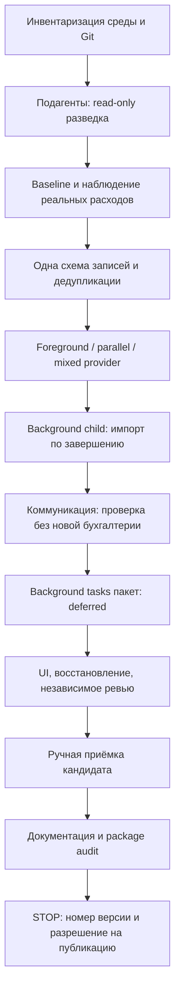
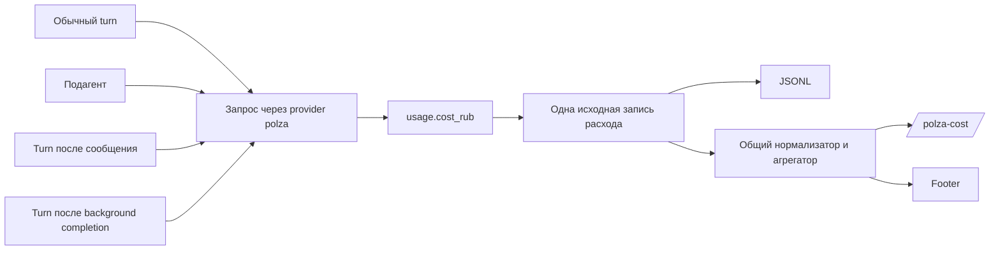
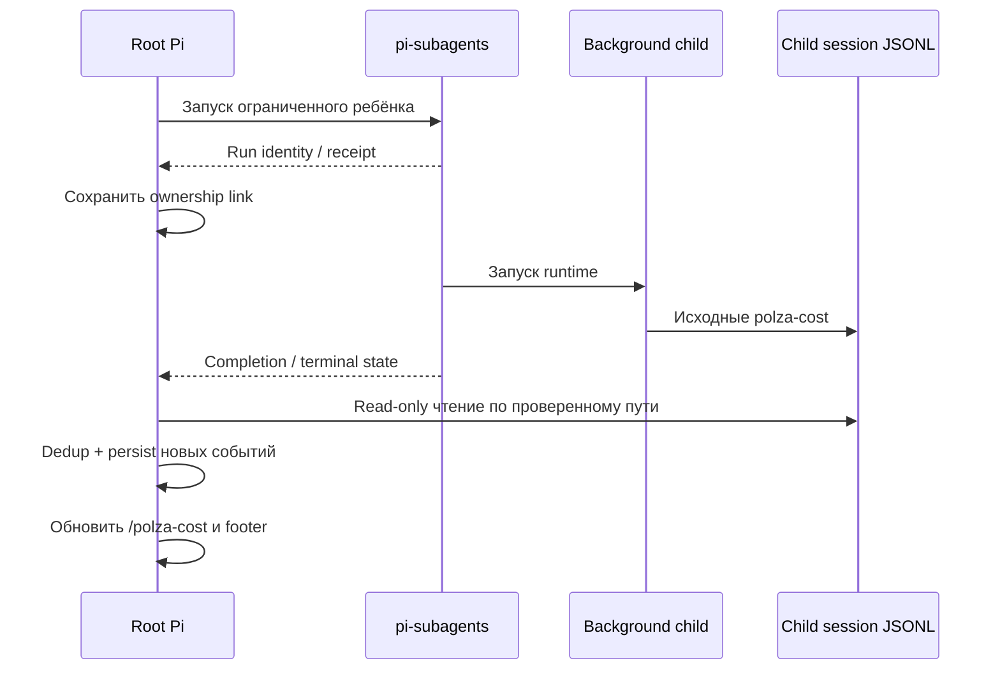

# pi-polza — детальный план релиза «0.0.2»

**Тема:** учёт расходов Polza при работе с подагентами, коммуникацией между агентами и фоновыми задачами.  
**Формат:** рабочее техническое задание для агента-разработчика в Pi.  
**Дата исследования:** 21 сентября 2026 года.  
**Исходное условие:** пользователь работает в самом Pi; плагины подагентов, коммуникации и background tasks уже установлены. Их нельзя автоматически переустанавливать, заменять другими пакетами или обновлять до `latest`.

> [!important] Сначала прочитать: номер релиза требует отдельного решения
> В запросе используется название **«0.0.2»**, поэтому оно сохранено как название этой работы. Однако при проверке публичного репозитория обнаружен уже существующий `package.json` с версией **0.1.1**, коммит `9469e457e2a6cfed1b4125650450665d03663962`. Проектная инструкция относит новую пользовательскую функциональность к `MINOR`. Следовательно, **0.2.0 — согласующийся с текущей историей кандидат**, а 0.0.2 оказался бы понижением версии. Агент не исправляет название запроса самовольно: выполняет работу в feature-ветке, сохраняет текущую package version до release-prep и получает решение по номеру перед её изменением. Ни один опубликованный тег не перемещается. [S01][S02]

> [!note] Что в документе является фактом, а что — планом
> Проверенные свойства репозиториев сопровождаются ссылками на первоисточники. Предлагаемые интерфейсы, имена новых файлов, тесты и правила агрегации — **проектные решения этого ТЗ**, а не якобы уже существующие API Pi. Установленные на машине версии и поведение конкретного сочетания плагинов необходимо подтвердить локально. Подготовка этого документа не является запуском перечисленных ниже live-тестов.

> [!warning] Background-tasks пакет вынесен за границы этого релиза
> Интеграция установленного пакета background-tasks **не выполняется в этом релизе** по решению пользователя: с пакетом есть нерешённые проблемы совместимости. Соответствующие разделы, TODO-пункты и коммиты помечены `deferred` и **не являются условием завершения релиза**. Тема сохраняется в документе как исследовательская заготовка на будущее, а не как обязательство. Это относится только к внешнему background-tasks пакету; background-подагенты `pi-subagents` ([Этап 2D](#stage2)) остаются в scope.

## Навигация по плану 🗺️

Первый проход — разделы 1–9 целиком. Затем агент переносит [Master TODO](#todo) в свой рабочий список и выполняет этапы по порядку. Перед каждой границей runtime нужно сверяться с [таблицей STOP](#stops), а не перезапускать текущий Pi по собственной инициативе.

| Основание | Выполнение | Контроль и завершение |
|---|---|---|
| [Результат и scope](#outcome) | [Этап 0: среда и baseline](#stage0) | [Тесты и live-приёмка](#tests) |
| [Находки в исходниках](#research) | [Этап 1: JSONL / trace](#stage1) | [Master TODO](#todo) |
| [Финансовые правила](#accounting-rules) | [Этап 2: subagents и расходы](#stage2) | [Коммиты и changelog](#commits) |
| [Дизайн данных и dedup](#data-design) | [Этап 3: коммуникация](#stage3) | [STOP / RESTART](#stops) |
| [Разработка внутри Pi](#pi-hosts) | [Этап 4: background tasks](#stage4) — `deferred` | [Спорные решения](#decisions) |
| [Обязательная работа подагентов](#development-agents) | [Дизайн footer и команд](#ui) | [RC и публикация](#release) |
| [Первичные источники](#sources) | [Шаблон итогового отчёта](#report) | После релиза — freeze |

<a id="outcome"></a>

## 1. Результат, который должен получить пользователь 🎯

Пользователь продолжает работать обычным способом: выбирает модель, поручает работу подагентам, запускает фоновые задачи и обменивается сообщениями между сессиями. `pi-polza` показывает **реально полученные от Polza расходы основной сессии и принадлежащих ей подагентов**, не смешивая их с расходами других поставщиков.

Главный сценарий:

```text
Основная сессия: Polza / модель A
    ├── scout: Polza / модель B
    ├── reviewer: другой поставщик / модель C
    └── worker: Polza / модель D, в фоне

/polza-cost:
    основной агент + scout + worker → учтены в ₽
    reviewer → не включён, это не Polza
```

Чужие провайдеры не пересчитываются в рубли и не отображаются как бесплатные. Баланс остаётся балансом одного аккаунта Polza, а не суммой «балансов агентов». Встроенный USD-cost Pi и стоимость в чужих плагинах не подменяются рублями.

**Обязательный минимальный результат:** расходы завершившихся принадлежащих сессии Polza-подагентов добавляются в `/polza-cost` и статусную строку, не дублируются и восстанавливаются после повторного открытия сессии. Обновление в процессе работы — полезное дополнение, но не основание строить брокер или новую базу данных.

### 1.1. Границы релиза 📦

| Входит обязательно | Входит при простой и доказанной реализации | Не входит |
|---|---|---|
| Polza-only accounting | Обновление суммы фонового ребёнка после каждого завершённого API-запроса | RUB→USD и учёт чужих поставщиков |
| Foreground и background native Pi-подагенты | Подробная разбивка по попыткам resume | Собственный transport / SSE-клиент |
| Разные модели, параллельные дети, последовательная цепочка | Дополнительная диагностика через существующие команды | Переписывание `/subagent-cost`, FleetView или trace viewer |
| Mixed-provider проверки | — | Новый менеджер задач, RPC-сервер, daemon, SQLite-ledger |
| Completion aggregation и восстановление из JSONL | Вложенные потомки — только если публичная ownership-связь уже доступна | Глубокая рекурсия, команды из десятков агентов, автоматический routing |
| Совместимость с установленным коммуникационным плагином | Расширенная разбивка причин LLM-вызовов | Media, STT/TTS, embeddings, новые reasoning-исследования |
| — | Дополнительные платформы после Windows/npm Pi | Автоматические публикации и обновления чужих плагинов |
| — | — | **Отложено на будущий релиз (`deferred`):** интеграция установленного background-tasks пакета — shell tasks и их follow-up, `bg_delegate` и другие delegate/Fusion-режимы |

**Необязательное нельзя незаметно превратить в условие завершения релиза.** Если дополнительная интеграция не складывается из доступных контрактов, она остаётся документированным ограничением, а не поводом месяц переписывать экосистему.

> [!warning] Background-tasks вне scope текущего релиза
> Строки про совместимость с установленным background-tasks пакетом переведены в «Не входит» и помечены `deferred`. Причина — известные проблемы совместимости пакета (см. [раздел 3.5](#research) и [Этап 4](#stage4)). Это решение пользователя, а не технический вывод агента.

## 2. Прямое поручение агенту-разработчику 🧭

Прочитать этот документ целиком, затем локальные `AGENTS.md`, правила проекта и `instructions/commit-and-release-guide.md`. Не начинать с установки плагинов: они уже установлены. Сначала установить, **какие именно пакеты и какие версии реально загружены**.

Создать постоянный TODO и вести его на протяжении всей работы. Использовать установленных подагентов для ограниченной разведки, независимого ревью и проверки тестового дизайна. Главный агент остаётся интегратором и единственным владельцем общего рабочего дерева и коммитов.

Работа выполняется по схеме:



В местах `STOP` агент **действительно заканчивает текущую работу и ждёт**. Он не пишет «нужен перезапуск» и затем продолжает тестировать старый runtime ещё двадцатью вызовами.

### 2.1. Что запрещено без отдельного согласования ⛔

Нельзя изменять глобальные настройки Pi, сбрасывать credentials, отключать установленные пользователем плагины, убивать все `node`/`pi` процессы, автоматически перезапускать собственный управляющий Pi или отправлять сообщения посторонним сессиям Intercom.

Нельзя менять код внутри установленного `node_modules` чужого плагина и затем объявлять совместимость с его официальной версией. Если без исправления upstream не обойтись, нужно предъявить воспроизводимый случай и отдельно согласовать патч, форк или ограничение поддержки.

Нельзя выводить `.env`, содержимое `auth.json`, request headers с авторизацией и полные промпты ради «диагностики ключа». Достаточно источника credentials и признака их наличия.

Нельзя публиковать ветку, тег, release или npm-пакет только потому, что пользователь попросил выполнить план. Для публикации предусмотрен отдельный финальный шлюз.

<a id="research"></a>

## 3. Что уточнилось при проверке исходников 🔎

### 3.1. Фактическая база pi-polza 📍

На момент исследования публичный `main` — **0.1.1 / `9469e457…`**. Это более свежая база, чем `v0.1.0 / 9a9733d` из предыдущих обсуждений. Агент обязан записать фактический локальный HEAD; откатываться к старому коммиту ради совпадения с перепиской нельзя. [S01]

В текущем исходном коде:

| Участок | Что действительно видно | Последствие для этой работы |
|---|---|---|
| `stream.ts` | Обёртка штатного API получает `model`, `context`, `options` и ставит response tap | Сохраняется единая точка получения реального `cost_rub` |
| `index.ts` | Callback добавляет запись в accumulator и вызывает `pi.appendEntry("polza-cost", record)` | Callback привязан к экземпляру расширения; наследование provider ребёнком требует проверки владельца записи |
| `accounting.ts` | У записи есть `modelId`, токены, `costRub`, optional `agentId` | Пока нет устойчивого идентификатора денежного события и полноценной ownership-связи |
| `coerceRecord()` | Восстанавливает базовые поля; существующие optional `agentId` и `anomalies` не переносит | Новые attribution-поля нужно сохранять и проверять round-trip тестом |
| `summarizeRecords()` | Складывает известные суммы, но не показывает количество записей без цены | Нужен признак неполноты, иначе частичная сумма выглядит полной |
| `tap.ts` | Отдаёт наблюдённый usage в `TransformStream.flush()` | Отмена/ошибка до flush требуют отдельного теста; отсутствие записи не означает бесплатный запрос |
| Статус | Активируется только при текущей модели `provider === "polza"` | Для основного агента другого поставщика с Polza-детьми потребуется новое правило видимости |

Это конкретные места расширения существующего кода, а не основание заменять его новым accounting framework. [S03][S04][S05][S06]

### 3.2. Foreground и background — не одна архитектура 🧩

В исследованном `pi-subagents` **0.70.1**, commit `1ac7b5e2652e9571164847ac2905ab4aded92791`, foreground-ребёнок — native Pi session внутри процесса родителя. Он не загружает все ambient extensions повторно, но получает зарегистрированные родителем providers. Background-ребёнок находится в detached runner; там действует отдельная загрузка ресурсов. [S09][S10]

Отсюда вытекают **две гипотезы, которые нельзя выдавать за готовый результат**:

- inherited foreground provider может вызвать родительский callback `pi-polza`, и деньги уже окажутся в родительском JSONL;
- background runtime может загрузить отдельный экземпляр расширения и записать деньги в дочерний JSONL.

Пока это не доказано на установленной версии, нельзя ни просто складывать parent+child, ни считать, что у каждого ребёнка обязательно есть свой `polza-cost`.

### 3.3. Полезная точка корреляции уже существует, но требует проверки 🔗

В актуальных типах Pi у `StreamOptions` есть optional `sessionId`, предназначенный в том числе для session-aware поведения providers. В `pi-polza` параметры уже проходят через обёртку. Это **первый кандидат** для фиксации execution session при старте запроса. Но наличие поля в типах не доказывает, что каждый конкретный child runtime его заполняет, и не гарантирует его равенство `SessionManager.getSessionId()`. [S04][S07]

Нужно сравнить реальные значения в main, foreground, background и вспомогательном LLM-вызове. Нельзя заменять `options.sessionId` своим ID: это может менять session affinity и кэширование. Для бухгалтерии хранится отдельный локальный идентификатор события.

### 3.4. У subagents есть публичные контракты — не нужно разбирать TUI 🔌

Документация предоставляет process-local RPC `subagents:rpc:v1:*`, structured delegation API и файловые lifecycle artifacts. В частности, public `ping` сообщает возможности; `status` позволяет получить структурированные сведения о работе. Сокращённая Fleet-проекция намеренно не содержит всех идентификаторов и путей. [S13]

`(runId, index)` можно использовать для идентификации foreground-строки в рамках run, но это **не идентификатор API-запроса**. Один ребёнок может сделать много вызовов; одна сохранённая child session может продолжаться в нескольких run.

### 3.5. «Background tasks» — неоднозначное имя ⚠️

В прошлых обсуждениях было чрезмерное упрощение: «этот плагин запускает только shell, значит отдельного LLM-учёта не требуется». Это верно не для каждого одноимённого пакета.

| Найденный пакет/репозиторий | Документированная роль | Как влияет на план |
|---|---|---|
| `@sakiko233/pi-background-tasks`, исследованная версия 3.1.0 | Shell tasks и общий lifecycle; отдельные external-task контракты | Основная проверка — shell + completion wake-up; само shell-ожидание не является LLM-вызовом |
| `pi-background-tasks` из `ismailsaleekh/pi-background-tasks`, в каталоге Pi — 2.5.0 | Помимо shell есть `bg_delegate`, `bg_run_pi_attested` и Fusion-инструменты | Такой пакет **сам может запускать дополнительные LLM-процессы**; нельзя объявлять полную поддержку после одного shell-теста |
| Другие форки с тем же display name | Возможны иные lifetime, инструменты и уведомления | Выбрать ветку проверки по реально установленному `package.json`, не по названию `/bg` |

Для `bg_delegate` документирован отдельный child session и режимы `isolated`/`ambient`; по умолчанию изоляция может исключать provider-extension. Вариант `ambient` решает обнаружение такого provider, но ослабляет изоляцию и требует осознанного выбора. [S18][S20][S21]

> [!warning]
> Агент не заменяет установленный background-плагин на `@sakiko233/...` ради удобства тестов. Сначала фиксируется реальная идентичность пакета. Если установленная версия расходится с исследованной, локальные исходники и фактический контракт имеют приоритет.

### 3.6. Коммуникация не равна владению расходами 📨

Современный `pi-subagents` имеет native supervisor coordination; его проверка не должна автоматически зависеть от отдельного `pi-intercom`. `pi-intercom` нужен для адресных сообщений между подключёнными сессиями. Входящее сообщение может запустить LLM-turn получателя, но само сообщение не делает получателя дочерним агентом отправителя. [S25][S17]

**Следствие:** сумма root-сессии включает только свои вызовы и подтверждённых потомков. Расходы произвольного Intercom-соседа, даже использующего тот же Polza-аккаунт, не импортируются.

<a id="accounting-rules"></a>

## 4. Одно финансовое правило для всех плагинов 💰

Базовая единица учёта — **реально наблюдённый ответ API Polza**, а не user turn, task, intercom-message или итоговая строка чужого плагина.

Polza документирует `usage.cost_rub` как готовую стоимость в рублях; в streaming usage приходит в завершающей части SSE. Поэтому точные деньги становятся известны на границе завершённого запроса, а не по каждому текстовому токену. [S23]



Ни adapter подагентов, ни adapter фоновых задач не вычисляет собственную цену. Они отвечают только на вопросы **«чья это запись?»** и **«где её прочитать?»**.

### 4.1. Инварианты, которые нельзя нарушать 🧮

| ID | Правило |
|---|---|
| FIN-01 | В RUB total входят только события фактического provider `polza` |
| FIN-02 | Один исходный billed response учитывается не более одного раза в одном root total |
| FIN-03 | Повторное уведомление, чтение файла, `/polza-cost` и reopen не увеличивают сумму сами по себе |
| FIN-04 | Две настоящие одинаковые генерации — две разные траты, даже если токены и цена совпали |
| FIN-05 | Unknown cost, missing child log и другой provider не превращаются в `0 ₽` |
| FIN-06 | Стоимость не пересчитывается по каталогу, времени работы или разнице глобального баланса |
| FIN-07 | Успешность задачи не определяет наличие расходов: failed/stopped ребёнок мог уже сделать платные запросы |
| FIN-08 | Completion import добавляет только ещё не учтённые исходные события |
| FIN-09 | Forked context не заставляет повторно оплачивать в отчёте старые записи родителя |
| FIN-10 | Чужая сессия не попадает в root total по совпадению модели, cwd, имени агента или API-ключа |
| FIN-11 | Рубли никогда не записываются в стандартное поле Pi с USD-семантикой |
| FIN-12 | Неизвестная полнота наблюдения видна пользователю; частичный subtotal не называется полным счётом |

### 4.2. Что означает итог сессии 🏷️

**Polza total текущей root-сессии** — уникальные Polza-вызовы, принадлежащие этой root-сессии и её доказанным поддерживаемым потомкам. Это не стоимость всей работы у всех поставщиков и не дневной расход аккаунта.

Навигация `/tree` не отменяет уже случившиеся траты. Fork/clone новой root-сессии, напротив, не должен заново включать исторические события только потому, что они скопировались вместе с контекстом. Для новой схемы нужны origin identifiers; для legacy-записей — консервативная миграция и явные ограничения.

Если запущен ребёнок другого поставщика, он отображается как **«другой provider — не входит в Polza»**. Если ребёнок в ходе работы сменил поставщика, фильтрация делается по **каждому запросу**, а не по его последней модели.

### 4.3. Когда обновлять сумму ⏱️

| Источник | Обязательная точка обновления | Допустимое улучшение |
|---|---|---|
| Основной Polza request | После получения authoritative usage | Нет необходимости обновлять по токенам |
| Foreground child с доступным capture | После каждого завершённого запроса либо при settlement ребёнка | Live-разбивка по ребёнку |
| Background child | После завершения/остановки и чтения его записей; также при явном открытии `/polza-cost` | Ограниченное чтение уже известных child files во время работы |
| Intercom-triggered turn | Как обычный запрос в сессии получателя | Отдельная причина turn только при надёжной корреляции |
| Shell background job | Сам job не добавляет искусственную сумму | Follow-up LLM-turn учитывается обычным способом |

Показать «есть 1 активная фоновая задача, её сумма ещё неполная» предпочтительнее, чем выдать последний известный subtotal за окончательный. В первой реализации не вводить постоянное сканирование всех сессий и поток рублей через Intercom.

<a id="data-design"></a>

## 5. Дизайн данных: минимум для корректной агрегации 🗃️

### 5.1. Развивать существующий формат, а не заводить вторую бухгалтерию 🧱

Сохранить `customType: "polza-cost"` и совместимость чтения старых файлов. Предлагаемое расширение — схема версии 2. Названия ниже являются проектной заготовкой, не API Pi.

```ts
interface PolzaCostRecordV2 {
  schemaVersion: 2;
  eventId: string;                 // Создаётся один раз у источника.
  timestamp: number;
  provider: "polza";
  modelId: string;                 // Provider-local ID, без угадывания vendor.
  costRub: number | null;

  promptTokens: number;
  cachedTokens: number;
  cacheWriteTokens: number;
  completionTokens: number;
  reasoningTokens: number;

  originSessionId?: string;        // Только подтверждённая execution session.
  rootSessionId?: string;          // Только подтверждённое владение.
  requestCorrelationId?: string;  // Если доступен реальный upstream/request ID.

  attribution?: {
    kind: "main" | "subagent" | "background-agent" | "unattributed";
    sourcePlugin?: string;
    runId?: string;
    childIndex?: number;
    agent?: string;
  };

  importedFrom?: {
    sessionId: string;
    entryId: string;               // ID исходной записи Pi, если он есть.
  };
  anomalies?: string[];
}
```

Необязательные поля не заполняются догадками. Отсутствующее `originSessionId` нельзя подменять именем модели. `eventId` — идентификатор локального факта наблюдения, а не обещание, что Polza присвоила запросу именно такой ID.

`eventId` создаётся **до передачи одной записи разным потребителям** и сохраняется при импорте. Если transport делает настоящую новую HTTP-попытку, это не та же самая запись только потому, что logical turn остался прежним.

### 5.2. Отдельная маленькая запись связи с ребёнком 🔗

Для восстановления достаточно сохранять в родительском JSONL компактную запись, например `polza-run-link`:

```json
{
  "schemaVersion": 1,
  "sourcePlugin": "pi-subagents",
  "rootSessionId": "root-session-id",
  "runId": "verified-run-id",
  "childIndex": 0,
  "agent": "reviewer",
  "childSessionId": "verified-child-session-id",
  "sessionFile": "runtime-reported-child-session-path",
  "state": "running"
}
```

Путь берётся из проверенного runtime-result/status/receipt, а не из текста ответа LLM. Если он появляется только после запуска, связь записывается, когда появилась достоверная информация. Состояния можно обновлять последующими append-only записями: старые строки не редактируются.

**Это не sidecar database.** Есть исходные денежные события и маленькие связи в штатном JSONL. У временных `pi-subagents` result/replay-файлов другая задача: часть из них удаляется или истекает, поэтому на них нельзя опираться как на единственную вечную память расходов. [S12]

### 5.3. Единый путь обработки 📐

Предпочтительная структура изменений:

```text
.pi/extensions/pi-polza/
  accounting.ts                  # Существующая нормализация/summary, расширенная.
  stream.ts                      # Существующий capture, а не новый transport.
  tap.ts                         # Существующий response tap.
  accounting-identity.ts         # Если выделение действительно упрощает код.
  accounting-reconcile.ts        # Один dedup + importer/rebuild.
  integrations/
    subagents.ts                 # Public metadata → ссылки на child sessions.
    background-delegate.ts       # Только если установленный пакет реально требует.
  presentation.ts / commands.ts  # Существующие UI-модули; без второго dashboard.
```

Не создавать папку из десятка интерфейсов до первого теста. Если три небольшие функции помещаются в существующие модули, оставить их там.

Концептуальный pipeline:

```text
Polza response → recordFromUsage → validate → deduplicate → persist → summary → UI
child JSONL   → read records     → validate → deduplicate → persist → summary → UI
```

Различаются источник и attribution; сложение денег, проверки валюты, обработка `null`, группировка и форматирование общие.

### 5.4. Правила дедупликации и legacy-чтения 🛡️

Для новых событий ключом является устойчивый `eventId`, сохранённый при переносе между журналами. Для старой записи без `eventId` допустим составной ключ из **подтверждённой исходной session identity и native entry ID**. Номер строки или индекс массива — только fallback внутри одного неизменного файла, не обещание глобальной идентичности.

Запрещено дедуплицировать по `(model, timestamp, costRub, tokens)` или по хэшу этих значений: два реальных одинаковых запроса могут совпасть. Также нельзя складывать `child total` поверх уже импортированных отдельных запросов.

Если origin legacy-записи невозможно восстановить после fork, импорт не должен молча включать весь скопированный prefix. Нужно обозначить неполноту и объяснить, что доказано, а что не доказано.

Если два экземпляра **одного `eventId`** содержат разные `costRub`, provider или origin, это конфликт идентичности. Не складывать их как два платежа и не применять молча «последняя запись побеждает». Сохранить безопасную диагностику, пометить затронутый subtotal как неполный и показать конфликт в тестовом отчёте. Новая версия схемы не должна маскировать такой конфликт пересозданием ID.

### 5.5. Полнота — отдельное состояние, а не цена ноль 🟡

Summary должен различать хотя бы:

```ts
interface AccountingCoverage {
  observedRequests: number;
  pricedRequests: number;
  unpricedRequests: number;
  pendingChildren: number;
  unavailableChildren: number;
  excludedNonPolzaChildren: number;
  complete: boolean;
}
```

Это проектная схема; уточнить названия по существующим типам. `complete: true` означает полноту **в пределах известных запросов и поддерживаемой ownership-области**, а не аудит всего аккаунта Polza.

Сумма известных `costRub` показывается даже при неполноте, но подписывается **«Учтено … ₽; данные неполные»**. Не делать вид, что неполученная terminal usage означает нулевую стоимость.

**Ошибка persistence — не успешный импорт.** Если `appendEntry` не сохранил запись, ответ модели всё равно отдаётся пользователю, но receipt остаётся `unpersisted`/partial. Нельзя продвигать durable watermark или утверждать, что сумма переживёт reopen. Разделить «наблюдено в памяти» и «подтверждённо сохранено»; повторная попытка записи с тем же ID не должна повторно прибавлять деньги. Если публичный API Pi не даёт подтверждения durable write, описать реальную гарантию и проверить восстановление новым процессом, а не обещать транзакционность.

### 5.6. Строгое чтение внешнего JSONL 🔒

Импортер принимает только принадлежащий текущей root-сессии файл, найденный по структурированным runtime metadata. Проверяет schema, native session header, provider, конечность чисел и допустимый формат записей. Обычная строка `costRub` в tool output не является денежным событием.

Чтение потоковое либо ограниченное; незавершённая последняя JSONL-строка откладывается до следующего чтения. Битая завершённая строка не превращается в нули. Ошибка чтения не ломает чат, но делает coverage неполным.

Не читать произвольный путь из LLM-текста, не следовать непроверенным выходам за ожидаемые session/artifact roots и не переписывать дочерний журнал. Native `sessionId` и `sessionFile` не взаимозаменяемы; в некоторых plugin-status поле с именем `sessionId` может содержать path, что нужно нормализовать отдельно. [S13]

<a id="pi-hosts"></a>

## 6. Работа внутри самого Pi: как не сломать среду разработки 🛠️

### 6.1. Три роли среды, а не три обязательные установки 🧪

Нужно различать:

| Роль | Назначение | Правило |
|---|---|---|
| **DEV_HOST** | Pi, в котором агент разрабатывает плагин и общается с пользователем | Не перезапускается автоматически; желательно работает на стабильной копии provider |
| **SOURCE** | Git-репозиторий, где меняется `pi-polza` | Здесь идут правки, тесты, коммиты |
| **TEST_HOST** | Отдельный пользовательский запуск или ограниченный интеграционный harness | Здесь загружается конкретный кандидат и собираются acceptance-доказательства |

Физически часть ролей может находиться на одной машине и пользоваться теми же установленными пакетами. Но **HEAD на диске и код, уже загруженный в процесс Pi, не одно и то же**.

На старте зафиксировать для DEV_HOST и TEST_HOST источник `pi-polza`: local path, Git package, npm/package artifact или project-local extension. Отдельно проверить, нет ли одновременно установленной и project-local копии с provider ID `polza`.

### 6.2. Предпочтительный режим 🧊

DEV_HOST использует стабильную проверенную копию. SOURCE меняется отдельно. TEST_HOST получает кандидат после завершённого логического блока. Для такого режима не требуется создавать нового provider с другим ID или менять API-ключ.

Если текущий DEV_HOST уже загружает SOURCE напрямую, агент должен:

1. закончить и собрать результаты всех собственных development-подагентов;
2. объяснить риск смешения загруженных и изменённых файлов;
3. предложить пользователю безопасный способ изоляции, не меняя глобальную установку самостоятельно;
4. при необходимости объявить `STOP R0 — подготовка стабильного host`;
5. до подтверждения выполнять только read-only исследование, документацию и offline-тесты, не запускать новые candidate-дети из меняющегося runtime.

Не копировать production credentials в репозиторий. В изолированном `PI_CODING_AGENT_DIR` credentials могут отсутствовать — это ожидаемо. Настройку тестовой авторизации пользователь выполняет через штатный `/login`, либо используется уже согласованный безопасный способ.

### 6.3. Что требует перезапуска 🔄

| Изменение | Достаточное действие | Условие |
|---|---|---|
| Только README, checklist, offline fixture | Перезапуск не нужен | Runtime не затронут |
| Код `stream`, `tap`, auth, регистрация provider, ownership capture | Новый TEST_HOST; DEV_HOST по ситуации | Перед следующей live-проверкой нужен доказанно новый код |
| Манифест пакета, runtime dependencies, способ загрузки child extension | Полный перезапуск тестового Pi | У children могли сохраниться старые module instances |
| Код UI без детей в работе | `/reload` допустим для локального просмотра | Финальная acceptance всё равно на новом процессе |
| Настройки Intercom scope/ENV или конфигурация background runtime | Перезапуск затронутых тестовых процессов | Не трогать чужие сессии |
| `/polza-refresh` | Обновляет каталог, **не код** | Не использовать как подтверждение загрузки нового commit |
| Background runner уже работает | Его код не обновляется от перезапуска parent | Для теста кандидата нужен новый run |

Pi документирует отдельные события `session_shutdown`, `session_start` и причины загрузки, включая reload/resume/fork. Эти границы используются для снятия подписок и восстановления состояния. [S08]

### 6.4. Универсальный протокол STOP/RESTART 🚦

Перед остановкой агент обязан создать/обновить `notes/compatibility/HANDOFF.md` и отметить TODO. Затем выдать пользователю сообщение такого вида:

```text
STOP R2 — нужно загрузить новый accounting runtime.

Готово:
- ...
Git HEAD: <sha>
Working tree: clean / <точный список оставшихся изменений>
Тесты: <команда, результат>
Загруженный DEV_HOST: <известная версия или unknown>
Подготовленный кандидат: <путь/артефакт, версия, fingerprint>

Работы в фоне:
- developer children: 0 active
- test children: 0 active
- intentionally surviving run: none

Действия пользователя:
1. Завершить именно указанный тестовый Pi.
2. Запустить Pi из указанного consumer workspace.
3. Убедиться, что загружен указанный кандидат.
4. Выполнить перечисленные ручные проверки.
5. Вернуться с сообщением «R2 пройден» или результатом ошибки.

Далее после подтверждения: задача T18, тест BG-02.
До подтверждения новые live-запуски и правки runtime не выполняются.
```

Нельзя продолжать только потому, что прошло время. Возобновление требует пользовательского подтверждения и проверки runtime fingerprint. Ранее загруженный detached runner не считается новым кандидатом даже при совпадающем пути к файлам.

**Исключение:** специальный тест «background завершился при закрытом parent». В handoff явно указан единственный намеренно оставленный run, его owner, бюджет и ожидаемое завершение. Это не забытая фоновая работа.

<a id="development-agents"></a>

## 7. Подагенты обязательны, но без бесконтрольного fan-out 🤖

Пользователь явно разрешил и потребовал использование подагентов. Главный агент должен реально привлечь их к работе, а не просто написать в отчёте, что «так можно было бы сделать».

### 7.1. Минимальная полезная команда 👥

| Роль | Задача | Доступ и ограничения | Артефакт результата |
|---|---|---|---|
| **scout-runtime** | Проверить installed Pi/subagents: provider inheritance, session identity, entry paths | Read-only; без live-вызовов, редактирования, установки пакетов | Краткая карта контрактов с файлами/строками |
| **scout-compat** | Определить реальный communication package, lifecycle и конфликты команд | Read-only; не менять глобальные настройки | Таблица surface → behavior → risk |
| **reviewer-accounting** | Независимо проверить dedup, mixed providers, fork/resume, partial coverage | Read-only review конкретного diff и fixtures | Blockers / non-blockers с воспроизводимыми случаями |
| **reviewer-release** | Проверить package, README, claims о совместимости, секреты в планируемых артефактах | Без публикации; не читать и не печатать реальные секреты | Короткий release verdict с evidence |

Один и тот же installed agent `scout`/`reviewer` может использоваться с разными поручениями. Не обязательно заводить четыре постоянных agent definition. По умолчанию одновременно работают **не больше двух read-only помощников**, а пишет код один исполнитель.

Если делегируется реализация, worker получает отдельный модуль и не пересекается по файлам с главным агентом. Runtime `stream.ts`, `index.ts`, `accounting.ts` и общие типы нельзя одновременно менять несколькими агентами. Общие коммиты делает интегратор.

### 7.2. Дети-разработчики и дети-тесты — разные группы 🧷

Development-помощники тратят реальные деньги, но **не должны загрязнять измеряемый fixture-run**. Их session/run IDs записываются отдельно. Для acceptance создаётся новая тестовая root-сессия либо снимается точная baseline-позиция событий, после которой выполняется ограниченный сценарий.

Нельзя проверять «ровно три запроса» в той же сессии, где параллельно несколько reviewers обсуждают код и основной агент генерирует отчёт. Сравниваются конкретные исходные события и scopes, а не субъективное количество сообщений в чате.

### 7.3. Шаблон поручения разведчику 📋

```text
Задача: исследовать <точный компонент> для pi-polza compatibility.

Режим: read-only. Не редактировать файлы, не коммитить, не устанавливать пакеты,
не запускать платные API-запросы и не запускать собственных подагентов.

База: <HEAD и реальный путь установленного пакета>.
Проверить только:
- <контракт 1>
- <контракт 2>
- <граница 3>

Вернуть:
1. Подтверждённые факты: путь, symbol, строки/короткое пояснение.
2. Что является гипотезой и каким одним тестом её проверить.
3. Минимальная точка интеграции без private imports.
4. Не более пяти существенных рисков.

Не пересказывать весь репозиторий. Не возвращать секреты или полный trace.
```

### 7.4. Шаблон поручения reviewer 🧾

```text
Проверь diff <base..head> и тесты <список>.
Режим read-only; не исправляй код сам и не запускай платные тесты.

Обязательные вопросы:
- Может ли один реальный запрос попасть в total дважды?
- Может ли чужая session/provider попасть в Polza total?
- Переживут ли идентификаторы и attribution reopen/fork/resume?
- Может ли отсутствие usage выглядеть как полная сумма?
- Не изменяет ли код lifecycle чужих плагинов или HTTP payload?

Каждое замечание: severity, файл/строки, сценарий, ожидаемое поведение.
Если blockers нет — так и напиши, но перечисли фактически проверенные границы.
```

### 7.5. Учёт рабочего прогресса ✅

Основной TODO сохраняется в `notes/compatibility/TODO.md`, а текущий короткий статус — также в установленном TODO-инструменте, если он есть. Это не две независимые очереди: IDs и состояния синхронизируются.

Статусы: `pending`, `in_progress`, `blocked`, `waiting_user`, `done`, `deferred`. Для `done` обязательны commit или evidence. Для `blocked` — причина и конкретное действие, снимающее блокировку. Для `deferred` — честное ограничение релиза.

Обновлять TODO:

- до начала логического блока;
- сразу после завершения теста/коммита;
- после получения ответа подагента;
- перед каждым STOP и после возобновления;
- перед финальным отчётом.

Нельзя оставлять уже опубликованный результат с TODO вида «0/9, README pending», как будто работа не выполнялась. И наоборот: `done` не означает «написан код», пока требуемая проверка не пройдена.

## 8. Бюджет, модели и безопасность тестов 💸

### 8.1. Выбрать модели по доступному registry, не по памяти 🧠

Использовать две доступные tool-capable модели Polza (`POLZA_A`, `POLZA_B`) и одного уже настроенного другого поставщика (`OTHER`). Полные строки должны иметь вид `polza/<provider-local-model-id>`; слеши внутри model ID не означают отдельного Pi provider.

Пример значения для `POLZA_A` можно взять из уже проверенного локального каталога, но нельзя жёстко требовать наличие конкретного Qwen/DeepSeek через месяц. Если `OTHER` отсутствует, mixed-provider unit-тест обязателен, а live-проверка отмечается `not tested`; новый платный аккаунт агент не создаёт.

`pi-subagents` поддерживает приоритет per-run/role/default и наследование модели. Для проверок нужно использовать exact provider/model и затем сверять **resolved model**, а не доверять только requested string. [S11]

### 8.2. Начальные live-ограничения 🛑

До платных тестов согласовать или подтвердить существующий бюджет. Разумная предлагаемая первая партия: **до 24 Polza HTTP-попыток**, максимум два concurrent child, короткие prompts, небольшой достаточный output; **5 ₽ — порог остановки и пересмотра**, а не обещание точного hard cap.

Это значения плана для согласования, не разрешение автоматически тратить деньги. Development-подагенты и acceptance probes учитываются раздельно, но обе категории показываются в итоговом отчёте.

Лимит расходов по фактическому `cost_rub` виден после ответа; уже запущенные запросы могут ещё завершиться. Нельзя называть post-factum guard абсолютной защитой бюджета. При неполной telemetry новые live-запуски приостанавливаются до разбора.

Стандартные USD cost limits стороннего subagent-плагина нельзя считать защитой Polza-баланса: текущий `pi-polza` оставляет USD cost равным нулю. Использовать реальные ограничения числа запусков, попыток, токенов и времени, подтверждённые в установленной версии. [S03][S05]

### 8.3. Не допускать скрытых дополнительных запусков 🧯

Для первых probes выбирать fresh context, отключать необязательные missions/watchdogs/recursion только через существующие локальные тестовые настройки, не меняя пользовательский профиль. Перед использованием любого поля проверить его schema в установленном `subagent` tool.

Не делать busy-loop из запросов LLM «проверь статус ещё раз». Машинное чтение status/RPC не должно запускать модель. Один supervisor ask и один reply достаточны для коммуникационного теста.

Все тестовые shell-команды конечные. У watchers есть известный timeout и целевой stop. Завершение tests считается доказанным по exit status, а не по тому, что background manager выдал job ID.

## 9. Публичные точки интеграции и запрещённые сокращения 🔌

### 9.1. Pi API: назначение каждой точки 🧩

| Точка | Использование | Что нельзя из неё заключать |
|---|---|---|
| `createProvider` / существующие `ProviderStreams` | Оставить действующую регистрацию и wrapper | Не превращать совместимость в миграцию всего provider |
| `StreamOptions.sessionId` | Кандидат для per-request origin capture | Не гарантирует наличие/семантику во всех callers без теста |
| `pi.appendEntry` | Persist исходных/импортированных accounting entries | Custom entry не означает автоматическое отображение в стороннем trace |
| `session_start` / `session_shutdown` | Rebuild, подписки, cleanup | Не использовать старый ctx после смены сессии |
| `tool_result` и typed result details | Наблюдать подтверждённые child launch/results | Не покрывает автоматически любой slash/RPC launch path |
| `after_provider_response` | Статус и headers до consumption | Это не готовый hook на body с `cost_rub` |
| `ctx.ui.setStatus` | Переиспользовать принятый status UX | Не заменять общий footer ради своих цифр |

Существующая theme/UI-интеграция сохраняется. Стриминг не буферизуется целиком ради получения денег. [S04][S06][S08]

### 9.2. pi-subagents: использовать capability discovery 🧭

В исследованной версии документированы:

```text
subagents:rpc:v1:ready
subagents:rpc:v1:request
subagents:rpc:v1:reply:<requestId>
```

Первый запрос — `ping`, затем поддерживаемые `status`-операции. Пример **по исследованной схеме**, подлежащий сверке с установленным пакетом:

```ts
const requestId = crypto.randomUUID();
const replyEvent = `subagents:rpc:v1:reply:${requestId}`;

// Сначала подписаться, затем emit; обязательно timeout + cleanup.
pi.events.emit("subagents:rpc:v1:request", {
  version: 1,
  requestId,
  method: "ping",
  params: {},
});
```

В production helper должен валидировать reply, снимать listener и возвращать `unavailable` по timeout. Он **не должен** регистрировать бесконечное ожидание, если plugin отсутствует или обновился.

Особые нюансы контракта:

- `events.asyncComplete` объявлен для корреляции RPC-spawn; не считать его универсальным событием завершения всех способов запуска.
- Короткий `status` может опускать filesystem details. Для конкретного run нужна targeted/rich projection.
- Fleet `key` — opaque display key, не `runId` и не путь.
- `pi.events` не является общей сетью всех Pi-сессий; даже внутри одного процесса child buses нельзя автоматически считать общим parent bus.
- Публичные `results[].index` помогают связывать строки одного run; для сумм нужны отдельные monetary event IDs.

Эти ограничения прямо влияют на adapter и тесты slash/tool/RPC-paths. [S13]

### 9.3. Child extension loading: не обходить явную политику 🔐

Если `extensions: []` или capability ceiling запрещает загрузку, provider-extension может быть недоступен background-ребёнку. Нельзя молча включать все ambient extensions, чтобы тест стал зелёным. Требуется понятная диагностика и документированный способ пользователя разрешить нужный provider. [S11][S14]

В исследованном пакете есть public export `pi-subagents/required-child-extensions` с `registerRequiredChildExtensions(...)`. Но реализация хранит **один snapshot на parent session** и отказывает при повторной регистрации. Поэтому это не безопасный «append» API для любого плагина. [S15]

**Решение релиза:** не использовать такой механизм без необходимости и не вытеснять чужую регистрацию. Если без собственного child hook невозможно получить корректный foreground capture, сначала исследовать обычное явное child-only подключение/поддержанный hook; при конфликте — STOP с двумя минимальными вариантами, а не правка private registry.

### 9.4. Что adapter не должен делать 🚫

Не вызывать LLM для чтения стоимости. Не парсить `/subagent-cost` или `/subagents-fleet` как текст. Не брать `totalCost` чужого плагина и выдавать его за RUB. Не переписывать `status.json` чужого owner. Не импортировать внутренние `src/*` чужого пакета в production.

Разрешены чтение исходников для исследования, public exports, документированные события и structured artifacts. Отсутствующий необязательный пакет не должен мешать загрузке `pi-polza`: optional integration не превращается в mandatory npm dependency со вторым экземпляром Pi SDK.

**Отдельно проверить module resolution.** Пакеты Pi могут устанавливаться с раздельными корнями модулей: наличие `pi-subagents` в `pi list` не гарантирует, что `import("pi-subagents/...")` разрешится из `pi-polza`. Поэтому для необязательной связи предпочтителен документированный event-bus RPC. Public TypeScript export допустим только при проверенном способе загрузки в установленной и упакованной среде. Не добавлять вторую npm-копию `pi-subagents` лишь ради разрешения import; ошибка discovery должна отключить только интеграцию, не сам provider. [S24]

<a id="stage0"></a>

## 10. Этап 0 — инвентаризация, baseline и рабочая ветка 📍

**Цель:** работать с реальной установленной системой, не с названиями из старой переписки.

### 10.1. Снять baseline без изменения среды 🔍

Выполнить отдельно, сохранив вывод без секретов:

```bash
git status --short
```

```bash
git rev-parse HEAD
```

```bash
git log --oneline -8
```

```bash
node --version
```

```bash
pi --version
```

```bash
pi list
```

```bash
npm test
```

Если `pi --version` или другая команда отсутствует в данной сборке, определить поддерживаемый эквивалент через `pi --help`, а не объявлять проект сломанным.

Не выполнять `git fetch`, обновление packages или `npm install` просто ради baseline. При грязном дереве перечислить изменения; не удалять и не stash-ить их молча. После проверки чистой базы создать рабочую ветку, например:

```bash
git switch -c feat/polza-plugin-compatibility
```

### 10.2. Инвентаризация установленных plugins 🧾

Зафиксировать для каждого: package name, repository, version, install source, resolved entrypoint, область user/project, загружен ли в текущем runtime, совпадает ли installed code с исследованными docs. Прочитать package-local `README`/`docs`/`SKILL.md`; агент использует именно поставляемую с установленной версией инструкцию.

Обязательные строки inventory:

```text
Pi runtime: version, npm/standalone, Node version
pi-polza: package version, source path/ref, loaded fingerprint
subagents: exact package name, version, entrypoint
communication: exact package name, version, entrypoint
background tasks: exact package name, version, entrypoints
trace: present/absent, exact version if present
TODO: actual available tool/command, or file-only fallback
```

Конфликты, которые проверить сразу: дубли `polza`, `subagent`, `contact_supervisor`, `bash`, `/bg`, `/tasks`, `Ctrl+B`, status/footer renderers. Наличие одинакового command name может приводить к suffix-именам; использовать реальный owner/source, а не молча вызывать первую строку. [S08]

### 10.3. Deliverables и шлюз G0 ✅

Создать:

```text
notes/compatibility/environment.md
notes/compatibility/TODO.md
notes/compatibility/decisions.md
notes/compatibility/HANDOFF.md
```

Абсолютные личные пути и чувствительные raw outputs остаются локальными либо обезличиваются перед commit. В публичный документ достаточно version/ref и типа установки.

**G0 пройден**, когда baseline воспроизводим, installed packages идентифицированы, два read-only scouts вернули контрактные находки, TODO создан, модель/бюджет probes определены, self-host strategy понятна.

Commit: `docs(compat): record installed plugin contracts and test scope`.

**STOP R0** только если нужно изменить источник плагина в DEV_HOST или пользователь должен подтвердить безопасную тестовую среду. Если текущая среда уже изолирована — отметить `R0 not required` с причиной и продолжить.

<a id="stage1"></a>

## 11. Этап 1 — короткая регрессия JSONL и trace 🔬

Это не новая интеграция с trace. Задача — убедиться, что будущая работа начинается с надёжного денежного журнала.

### 11.1. Минимальный сценарий 🧪

В выделенной тестовой root-сессии выполнить один короткий Polza-запрос и один bounded tool-loop. Найти **точный** native session JSONL через SessionManager/поддержанный Pi-интерфейс. Сверить исходные `polza-cost` и `/polza-cost`.

Не закреплять в тесте предположение «tool-loop всегда два запроса»: модель может сделать несколько вызовов или retry. Правильное ожидаемое количество определяется инструментированными реальными HTTP-ответами.

Если trace установлен, пользователь запускает `/trace`, проверяет создание отчёта и наличие обычных LLM/tool событий. Native session JSONL и trace `events.jsonl` — разные файлы. Рубли нужны в первом; отдельная визуализация RUB внутри HTML **не требуется**. [S22]

### 11.2. Критерии G1 ✅

- [ ] Все исходные наблюдённые billed Polza responses присутствуют в native JSONL.
- [ ] Сумма совпадает с `/polza-cost` до округления представления.
- [ ] Открытие отчёта и команд само по себе не создаёт Polza LLM-вызовов.
- [ ] Trace не падает из-за `polza-cost`; отсутствие RUB в его UI не считается провалом.
- [ ] Raw logs не попадают в публичный commit.

Если `/trace` падает из-за Python/кодировки, классифицировать проблему как renderer/environment issue, а не править provider наугад. Требования и interpreter override берутся из установленного trace package. [S22]

Commit нужен только для новых fixtures/тестов/документации: `test(compat): establish native RUB logging baseline`.

<a id="stage2"></a>

## 12. Этап 2A — измерить реальные пути foreground/background, до архитектурных правок 🧭

**Цель:** получить таблицу маршрутизации денег и решить, что уже учитывается автоматически.

### 12.1. Четыре ограниченных probes 🔎

| Probe | Сценарий | Что фиксируется |
|---|---|---|
| P-MAIN | Основная сессия, Polza A, один запрос | Request identity, callback instance, native session ID/path, запись |
| P-FG | Один foreground child, Polza B, fresh context | Наследование provider, значение stream `sessionId`, где записан `polza-cost` |
| P-BG | Один background child, Polza B | Native auth без dev `.env`, загрузка provider, дочерний JSONL, result identity |
| P-MIX | Основной/дочерний вызов другого настроенного provider | `pi-polza` не создаёт для него RUB record |

Временная instrumentation печатает только локальные correlation IDs, provider/model ID, фазу и сведения о записи. Не печатает request body, headers и секреты. Для живого расхода не добавлять повторные API-запросы «для диагностики».

### 12.2. Обязательная таблица результата 📊

```text
mode | requested provider/model | resolved provider/model
     | options.sessionId | actual child sessionId
     | provider instance owner | capture log path
     | event count | observed RUB | attribution confidence
```

`modelId` — не достаточная identity. Особенно нужен тест, где основной агент и ребёнок используют **одну и ту же модель**: неверная корреляция по имени модели иначе не обнаружится.

### 12.3. Выбор минимального решения D1 🪛

| Наблюдение | Действие |
|---|---|
| FG-запросы уже попадают в parent JSONL и имеют достоверный child session ID | Дополнить attribution; **не импортировать эти деньги второй раз** |
| FG-запросы попадают в parent JSONL, но origin неизвестен | Сумма сохраняется как Polza/unattributed; исследовать `options.sessionId` или минимальный child hook для разбивки |
| FG-записи идут в child JSONL | Использовать общий completion importer, как для background |
| FG provider доступен, но custom capture не вызывается | Найти обход transport/регистрации; это реальный blocker заявленной поддержки |
| BG provider не загружается | Проверить installed source, cwd, extension allowlist и credentials; не отключать policy автоматически |
| BG пишет `polza-cost` в свою session | Связать её с run и импортировать исходные записи |
| BG пишет только обычный usage с USD `0` | Не пересчитывать цену; сначала обеспечить вызов существующего Polza capture |

Если `options.sessionId` не даёт надёжной identity, нельзя использовать глобальный `currentAgent`, тайминг «следующий запрос» или `process.env` как runtime-корреляцию параллельных детей. В одном процессе несколько сессий могут жить одновременно.

Допустимое упрощение: сохранить корректный total и временно показывать часть FG-записей как `Unattributed Polza`, если per-child детализация требует вмешательства в приватный runtime. Но это отдельно согласуется как **частичная attribution**, не маскируется под полный per-agent report.

### 12.4. Критерии G2 и STOP по блокеру ✅

G2 требует evidence для всех четырёх путей, решения D1 на одну страницу и независимого review плана дедупликации. До этого не начинать общий импорт `parent + children`.

Commit: `test(subagents): capture foreground and background accounting paths`.

Если отсутствует стабильная monetary identity или source path нельзя связать с owner без эвристик — **STOP D1**. Отчёт должен предлагать конкретное небольшое изменение, а не «нужна ещё архитектура».

## 13. Этап 2B — укрепить существующий accounting core 🧱

### 13.1. Работы 🛠️

Добавить additive schema/version и стабильную идентичность новых событий. Расширить legacy reader так, чтобы attribution/anomalies не терялись. Общую функцию ingester использовать для live capture и чтения child events.

Исправить summary: отдельно known subtotal и coverage. Обработать реальные `0`, `null`, malformed values и неизвестную полноту. Для сравнения денежных чисел в тестах использовать контролируемую численную погрешность; не округлять каждое событие перед суммированием.

Фиксировать request ownership **при начале вызова**, а не читать текущую выбранную модель и active session после завершения долгого SSE. При переключении сессии нельзя записать поздний расход в новую root. Если корректная доставка в старую сессию недоступна — оставить исходную запись у её владельца и восстановить через reconciliation при reopen, не дописывать чужой JSONL вручную.

### 13.2. Abort и неполная telemetry ⚠️

Тестировать отдельно:

```text
получен usage → затем cancellation
cancellation → usage не получен
ошибка HTTP до body
обрыв после части body
повторный завершённый request после retry
```

Если authoritative usage уже наблюдался, он не должен теряться только из-за отсутствия нормального `flush`. Если usage не пришёл, не придумывать списание и не объявлять нулевую цену. Использовать состояние incomplete/missing telemetry для известной попытки.

Не превращать это в полную реализацию нового SSE протокола. Сохранить исходные bytes, backpressure, callback contracts и штатный transport. Отдельно проверить UTF-8 split, CRLF, финальный usage, несколько usage-сообщений и повторный callback.

### 13.3. Проверки и коммиты ✅

Минимум: old/new record round-trip, provider validation, stable identity, повторный import, unknown coverage, abort, tool-loop, two identical requests, concurrent requests, отсутствие влияния на transport.

Рекомендуемые commits:

```text
feat(accounting): persist source identity and coverage metadata
fix(accounting): preserve attribution during session rebuild
fix(stream): retain observed usage across incomplete responses
```

Последний commit нужен только если тест выявил дефект и исправление реализовано. Не добавлять фиктивный «fix» ради плана.

После offline gate — **STOP R1**: пользователь загружает кандидат в TEST_HOST. Затем один normal/tool-loop и reopen подтверждают, что старый основной сценарий не сломан. Не переходить к массе новых child-тестов на непроверенном core.

## 14. Этап 2C — foreground, разные модели и mixed providers 🤖

### 14.1. Что реализуется 🧩

В соответствии с D1 привязать исходные Polza-события к execution session и подтверждённому run/child. Записи, уже захваченные родительским provider callback, **переатрибутируются в представлении**, но не добавляются второй денежной копией.

Публичные metadata собирать в адаптере. Он не пишет в чужие result/status и не меняет модель дочернего агента. Capture остаётся независимым от наличия `pi-subagents`.

### 14.2. Обязательные сценарии 🧪

| ID | Запуск | Ожидаемый результат |
|---|---|---|
| FG-01 | Main Polza A → child Polza B | Child работает и его observed RUB входит в root total |
| FG-02 | Main Polza A → child Polza A | Общая модель не смешивает identity |
| FG-03 | Два параллельных ребёнка A/B | Нет перезаписи `currentAgent`, потерь и двойных записей |
| FG-04 | Два параллельных ребёнка одной роли и одной модели | Различаются по runtime identity, не по имени |
| FG-05 | Последовательная цепочка из двух детей | Сумма событий равна совокупности двух исполнений без добавления chain subtotal |
| FG-06 | Main Polza → child OTHER | Child не включается в RUB total и не выглядит как `0 ₽` |
| FG-07 | Main OTHER → child Polza | Polza-расход всё равно виден; footer не скрывает его только из-за модели main |
| FG-08 | Один child failed после успешного платного шага | Уже полученные billed responses сохранены |
| FG-09 | Запуск через обычный tool и отдельно через используемый slash/delegation path | Adapter не зависит только от одного способа запуска |

До каждого сценария фиксировать start boundary и список run IDs. Не смешивать эти проверки с real-world development-поручениями.

### 14.3. Критерии G3 ✅

Все обязательные FG-сценарии проходят в пределах доступных providers; для unavailable OTHER — отдельное явное ограничение live-проверки при обязательном offline mixed test. Проверена невозможность импортировать соседнюю session из того же cwd.

Commit: `feat(subagents): attribute foreground Polza usage without double counting`.

Если изменён provider registration/capture — новый TEST_HOST обязателен до live. Если менялся только adapter и подтверждён reload lifecycle, возможен согласованный `/reload` после завершения всех children; это фиксируется в evidence.

## 15. Этап 2D — background children и импорт расходов по завершению ⏳

### 15.1. Основная реализация: completion-first 🧾

У родителя сохраняется проверенная связь с запущенным run. После terminal result/уведомления адаптер получает или восстанавливает child `sessionFile`, читает **исходные** `polza-cost`, пропускает уже известные `eventId`, сохраняет новые записи в свой штатный журнал и обновляет summary/footer.



Уведомление — триггер проверки, **не само денежное событие**. Если уведомление пришло два раза, сумма не меняется второй раз. Если оно потерялось, `/polza-cost` и reopen выполняют bounded reconciliation по уже сохранённым owned links.

### 15.2. Что делать при недоступных артефактах 🟡

Результаты/receipts могут быть временными. Поэтому связь с run сохраняется, когда она доступна, а уже импортированные финансовые записи остаются в root JSONL. После удаления child-артефактов учтённые деньги не исчезают. Если ещё не импортированный журнал потерян, summary показывает incomplete; не пишет `0 ₽`. [S12]

Не сканировать весь `~/.pi` и не выбирать «последнюю похожую session». Ограничиться известными owned run IDs и структурированным status/replay. Если финальный callback не покрывает все launch paths, добавить on-demand reconciliation, а не свой scheduler.

### 15.3. Resume, fork и parent switch 🧬

**Resume:** один child JSONL может продолжить расти. При повторном completion добавляются только новые исходные события; новый run ID не разрешает повторно просуммировать всю историю.

**Forked child:** проверить, копируются ли родительские custom entries. Перенесённые старые event IDs не считаются новыми расходами ребёнка. Если plugin дополнительно создаёт LLM-summary для подготовки fork, эта генерация — самостоятельный реальный запрос и должна учитываться там, где была вызвана.

**Parent switch:** позднее завершение ребёнка root A при открытой root B не должно увеличить B. При возврате в A выполняется reconciliation. Запись в root A задним числом прямым append к открытому кем-то файлу не используется.

**Parent exit:** для проверки сохранить owned links, оставить только один специально ограниченный background run, закрыть parent по команде пользователя, дать ребёнку закончить, открыть ту же root и восстановить сумму. Этот сценарий не даёт агенту права оставлять бесконтрольные фоновые задачи после обычного STOP.

### 15.4. Минимальная live-матрица BG ✅

| ID | Проверка | Критерий |
|---|---|---|
| BG-01 | Native `/login`, без workspace/dev `.env` | Child получает provider и auth штатно |
| BG-02 | Один background Polza child | В child/root есть authoritative record; root импортирует ровно один раз |
| BG-03 | Два background child, разные модели | Итог содержит обе группы без смешения |
| BG-04 | Повторный completion/status/reconcile | Сумма неизменна |
| BG-05 | Resume того же child session | Добавлены только новые запросы |
| BG-06 | Fork с существующими parent cost entries | Старые деньги не умножились |
| BG-07 | Root A → root B → завершение A-child | B не загрязнена; A восстанавливается |
| BG-08 | Parent закрыт во время конечного child | После reopen доступны новые ₽ либо явная неполнота, без выдуманного успеха |
| BG-09 | Failed/stopped child | Учтены полученные billed responses, неизвестное помечено |
| BG-10 | Child file недоступен/частичная строка | Нет падения; корректный partial state |
| BG-11 | Background child OTHER | Не входит в Polza total |
| BG-12 | Запрещённые extensions | Понятная диагностика; policy не обойдена |

BG-04/10/12 в первую очередь проверяются детерминированными fixtures; платные повторы для них не обязательны. BG-01/02/05/06/07 требуют реального SDK/plugin-path, насколько позволяют бюджет и согласованный scope.

### 15.5. Где остановиться 🚦

После реализации и offline tests — **STOP R2** для загрузки кандидата и ручного foreground/background UX. Отдельный `STOP R2-RESUME` используется для controlled parent-exit test.

Commit: `feat(subagents): reconcile completed child RUB into root sessions`.

**G4 пройден**, когда итог завершившихся owned children корректен, reopen не зависит от повторного наличия уже импортированного временного receipt, unknown не маскируется и нет двойного подсчёта FG/BG.

Live streaming child-cost в root в этом релизе не обязателен. Если реализация требует отдельного канала, watcher на всё дерево или Intercom state replication — её отложить.

<a id="stage3"></a>

## 16. Этап 3 — коммуникация: совместимость, не новая система учёта 📨

### 16.1. Разделить две проверки 🔀

**Native supervisor:** ребёнок обращается к своему родителю через поддержанный `contact_supervisor` / parent-side механизм установленного `pi-subagents`. Это проверяется как часть child lifecycle и не требует универсальной Intercom-бухгалтерии. [S25]

**Установленный коммуникационный пакет:** если это `nicobailon/pi-intercom`, проверить адресное сообщение/ask/reply между двумя тестовыми сессиями или поддержанными детьми. Если установлен другой пакет, сначала применить его фактический контракт; не заменять его на Intercom молча.

### 16.2. Изоляция сообщений и ограничение циклов 🔐

Для Pi Intercom использовать реальные session IDs, полученные через discovery. Имя, cwd и место в списке — не доказательство parent/child ownership. В исследованной версии поддерживается `PI_INTERCOM_SCOPE_ID`; при его использовании тестовые участники запускаются пользователем с одним отдельным scope до старта Pi. Не задавать одинаковый global `stableId` всем сессиям. [S17]

Если изменение ENV/scope требует перезапуска, объявить отдельный STOP и выдать точные инструкции только для тестовых процессов. Не переконфигурировать broker, обслуживающий рабочие сессии пользователя.

Ограничение диалога: одна задача, один ask, один reply, один финальный ответ. Не использовать автоматические подтверждения подтверждений. `inboundTrigger` влияет на дополнительные turns; сохранить и задокументировать реальную настройку. Входящие сообщения могут запускать модель, но transport IPC сам по себе не является Polza API-вызовом. [S17]

### 16.3. Матрица COM 🧪

| ID | Сценарий | Денежная проверка |
|---|---|---|
| COM-01 | Native child спрашивает supervisor и продолжает | Все реально состоявшиеся Polza-вызовы child/parent учитываются один раз |
| COM-02 | Progress update без ожидаемого wake | Не приписывать оплату самому сообщению; смотреть реальные запросы |
| COM-03 | Intercom-сообщение будит Polza-получателя | Расход возникает у execution session получателя |
| COM-04 | Intercom-сообщение будит получателя OTHER | `pi-polza` не создаёт ему RUB-cost |
| COM-05 | Два owned sibling child общаются | Root суммирует их исходные денежные события, не сообщения |
| COM-06 | Сообщение отдельному peer с тем же Polza-аккаунтом | Peer expense не становится автоматически расходом root отправителя |
| COM-07 | Reply/notification повторён | Нет повторного импорта уже учтённых денежных записей |
| COM-08 | Нет адресата / timeout ask | Нет вечного ожидания; уже потраченные ₽ сохраняются |

COM-05 обязателен только если installed plugin действительно поддерживает выбранный child communication path без обхода его lifecycle. В противном случае прямой peer-тест остаётся валидным, а sibling-path помечается `not tested`, не «совместим автоматически».

### 16.4. Код и критерии G5 ✅

Если эти сценарии проходят через существующий capture/reconcile, **production-код `pi-polza` не меняется**. Нужны только tests и compatibility docs.

Не подписывать бухгалтерию на все broker messages, не хранить chat transcripts в финансовых событиях и не переводить токены сообщений в деньги. Optional attribution `trigger=intercom` не входит в обязательный scope.

Commit: `test(intercom): verify Polza accounting across message-triggered turns`.

G5 требует отсутствия cross-session leakage, корректного mixed-provider поведения, завершения всех тестовых ask и возвращения участников к idle. Перед следующей фазой не должно остаться ожидающего reply агента.

<a id="stage4"></a>

## 17. Этап 4 — установленный background-tasks пакет ⚙️

> [!warning] DEFERRED — вне scope текущего релиза
> Весь этот этап **не выполняется в текущем релизе** по решению пользователя: с установленным background-tasks пакетом есть нерешённые проблемы совместимости. Содержимое раздела сохраняется как исследовательская заготовка на будущий релиз, а не как рабочее задание. Критерий **G6 не является шлюзом релиза**, коммиты C10/C11 не выполняются, TODO-пункты T23–T26 находятся в статусе `deferred`. Агент не обязан выбирать ветку A/B/C, запускать background-плагин или заявлять совместимость с ним. Background-подагенты `pi-subagents` относятся к [Этапу 2D](#stage2) и остаются в scope.

### 17.1. Сначала выбрать правильную ветку 🪪

Инвентаризация G0 определяет одну из веток:

**A. Shell/task lifecycle без собственного LLM-delegate.** Проверяются команды, output, completion, follow-up и совместимость UI. Дополнительного accounting adapter, вероятно, не потребуется.

**B. В пакете есть собственный LLM-delegate.** Нужна отдельная проверка его provider loading, native auth, session files и ownership. Использовать общий importer, а не второй расчёт денег.

**C. В пакете есть Fusion/multi-model automation или сторонний runtime.** Наличие команды не означает, что её нужно запускать. Такой режим требует отдельного одобрения scope и бюджета; без теста явно исключается из заявлений о совместимости.

Вывод «background = shell = бесплатно» разрешён только для конкретной тестовой команды, которая действительно не вызывает API. Shell может запустить `curl`, Python AI-клиент или отдельный `pi`; произвольная shell-команда не гарантированно бесплатна.

### 17.2. Ветка A — конечный shell и wake-up 🧪

Для теста создать безопасный fixture-helper, например `tests/fixtures/bg-finite.mjs`, который выполняет только `setTimeout` и печатает `DONE`. Он не читает секреты, не делает сетевых вызовов и не запускает модель. Использовать Node той же тестовой среды, а не платформозависимые `sleep`/`timeout` без проверки shell.

```js
// Пример нового тестового fixture, не существующий API плагина.
setTimeout(() => {
  process.stdout.write("DONE\n");
}, 500);
```

Поле управления completion-trigger взять из schema установленного `bg_run`/`bg_task`. Не переносить аргументы между одноимёнными пакетами.

| ID | Сценарий | Что доказывается |
|---|---|---|
| SH-01 | Запуск конечного helper с LLM wake выключенным | Сам helper не создаёт Polza API-запросов |
| SH-02 | Тот же helper с разрешённым completion wake | Если случился новый Polza turn, он учтён обычным provider capture |
| SH-03 | Основная модель OTHER при completion | Нет ложного RUB record |
| SH-04 | Helper завершился с ненулевым exit code | Ошибка shell не превращается в выдуманную денежную сумму |
| SH-05 | Пользователь/тест остановил один конкретный helper | Остановка не удаляет уже зафиксированные LLM-расходы |
| SH-06 | Повторная доставка completion | Повторный импорт не создаёт денег; реальный дополнительный LLM-вызов, если он произошёл, всё же учитывается |
| SH-07 | Background shell внутри Polza-subagent, затем follow-up | Нет двойного подсчёта child + shell + parent |

Чтобы проверить отсутствие расхода **во время shell**, исходную точку нужно ставить после LLM-запроса, которым агент решил вызвать инструмент, либо запускать helper вручную/детерминированно. Сумма всей сессии может меняться из-за других разрешённых запросов — поэтому смотреть конкретный fixture scope, а не только глобальный footer.

### 17.3. Ветка B — собственный background delegate 🧩

Для исследованного `ismailsaleekh/pi-background-tasks` public `bg_delegate` имеет точный `route: {provider, model}`, отдельный child session и `extensionMode`. `isolated` по умолчанию может не загрузить `pi-polza`; `ambient` разрешает discovered extension code и меняет изоляционные гарантии. [S21]

Требуемый порядок:

1. Подтвердить, что инструмент существует в установленной версии.
2. Проверить отказ/диагностику isolated-route с extension provider без попытки обойти политику.
3. Согласовать тестовый ambient режим, если он действительно нужен; не менять глобальные defaults.
4. Запустить один inspect-only delegate на exact Polza route, с маленькими `maxTurns`/`maxToolCalls` и timeout по его schema.
5. Взять child session identity/path из receipt/result/manifest, не из произвольного текста.
6. Прочитать те же `polza-cost` и передать их в **общий ingester**.
7. Проверить повторный completion/reopen/mixed-provider exclusion.

Adapter этой ветки должен возвращать ту же внутреннюю структуру owned child link, что и adapter `pi-subagents`. Он не должен повторять JSONL-reader, summation, currency handling и UI.

Если нужный child transport не использует зарегистрированный `pi-polza` provider и не даёт authoritative RUB, остановиться и сообщить ограничение. Нельзя считать его `totalCost` рублями по похожему полю. Для релиза допустима явно ограниченная совместимость **«shell + completion wake tested; delegate not supported/tested»**, но не общий зелёный значок для всего пакета.

### 17.4. Не расширять EventBus чужими полями 🚫

У scoped `@sakiko233/pi-background-tasks` external-task v2 — закрытый generic contract. В него нельзя вставлять произвольные `costRub`, `polzaModel` или свои финансовые поля. [S19]

Для этой работы его EventBus нужен только если требуется прочитать документированную task identity/terminal state. Чужой task registry не становится accounting storage.

### 17.5. UI и lifecycle совместимость 🖥️

Background-плагин может переопределять `bash`, иметь автоперенос команды в фон, собственный dock и `Ctrl+B`. Подагенты также могут иметь detach shortcut. Перед тестами убедиться, что keyboard action относится к ожидаемому owner.

Не «исправлять» конфликт удалением чужого shortcut без согласования. Для теста можно пользоваться явными slash/tool-командами. Для `npm test` или build, попавшего в background, необходимо дождаться подтверждённого terminal exit; launch receipt не равен успешному тесту.

**G6 пройден:** выбранная ветка проверена, основная функция provider не сломана, shell и wake-up расходы не перепутаны, непротестированные delegate/Fusion-режимы явно перечислены.

Коммиты:

```text
test(background): verify shell completion and Polza follow-up accounting
feat(background): reuse child accounting for delegated Pi runs
```

Второй commit нужен только для реально установленной и реализованной ветки B.

<a id="ui"></a>

## 18. UI: расширить смысл, не переделывать принятый интерфейс 🎨

### 18.1. Footer должен отвечать на два вопроса 💳

Сохранить нативный `setStatus`, semantic theme и уже принятый пользователем спокойный вид. Не создавать новую панель или вторую постоянно мигающую строку.

Основной вариант:

```text
Polza 41.10 ₽ | Spent 0.52 ₽
```

Для незавершённых background children:

```text
Polza 41.10 ₽ | Spent 0.52 ₽ · 1 pending
```

Для неполных данных:

```text
Polza 41.10 ₽ | Recorded 0.52 ₽ · partial
```

Окончательные подписи привести к принятому в проекте языку UI. В README на русском пояснить scope. Числа в примерах — иллюстрации, не результаты измерения.

**Правило видимости:** строка уместна, если текущая модель Polza **или** в root есть учтённые Polza-расходы/известные активные Polza-дети. При переходе main на другой provider не скрывать продолжающие учитываться Polza children. В новой пустой unrelated session строку не навязывать.

### 18.2. `/polza-cost` — единый подробный отчёт 📊

```text
Polza spending — this session and owned children

Main / service calls
  polza/model-a                       0.1800 ₽

Subagents
  scout · model-b                     0.0310 ₽
  reviewer · model-a                  0.0820 ₽

Background agents
  worker · model-b                    0.0740 ₽  completed
  researcher                         pending

Recorded Polza cost                  0.3670 ₽
Coverage                             9 priced requests; 1 child pending

Not included in Polza accounting
  oracle · other-provider/model-c

Other providers are not priced by pi-polza.
```

Требования к представлению:

- Чужой provider — `not included`, **не `0 ₽`**.
- Нет подтверждённой attribution — `Unattributed Polza`, а не автоматически `Main`.
- Одна child session после resume не создаёт повторный ряд с повторно начисленным cumulative subtotal.
- `Observed request count` отделён от числа tasks/агентов/turns.
- Prompt tokens уже включают cache subsets; output уже включает reasoning subset по текущей проверенной нормализации.
- Длинные model/agent names сокращаются только визуально; полные IDs доступны в подробностях.
- Empty state отличается от unavailable/partial state.

При наличии `/subagent-cost` рядом пояснить: это отчёт другого плагина по его usage/cost-семантике; authoritative Polza RUB — в `/polza-cost`. Не заменять одно имя команды другим и не патчить чужую валюту.

### 18.3. `/polza-balance` и `/polza-model-info` 🧾

Баланс остаётся общим кошельком. Он может изменяться от других сессий и приложений; разница balance не является доказательством стоимости одного run. Существующие TTL/error/stale поведения сохранить.

`/polza-model-info` остаётся информацией о выбранной модели, не о последнем ребёнке. `unknown`, declared и verified не смешивать. Не возвращаться к reasoning экспериментам в этой итерации.

Можно добавить небольшую строку совместимости/coverage в существующий диагностический вывод, если это упрощает поддержку. Новая обязательная slash-команда не нужна.

### 18.4. Визуальные проверки 🎛️

Проверить тёмную и светлую theme, узкий терминал, большой cost, маленькие доли рубля, unavailable balance, pending children, смешанные providers и соседство со статусами background/FleetView/Intercom.

Адаптеры снимают listeners/timers на shutdown/reload. UI не должен инициировать LLM-turn, блокировать ввод, сдвигать владельца editor/footer или печатать многократно одни и те же предупреждения.

Commit: `feat(ui): show Polza-only totals with child coverage`.

После общего пакета runtime/UI изменений — **STOP R3**: пользователь смотрит результат в настоящем TUI. Screenshot тестовый, без ключей и чувствительных путей. Ручное «всё работает» фиксируется в TODO/evidence с version/ref, а не приписывается автоматически.

<a id="tests"></a>

## 19. Обязательная детерминированная тестовая матрица 🧪

Ниже — минимальный набор **поведенческих случаев**, а не требование создать по отдельному файлу на каждую строку. Часть реализуется table-driven тестами. `npm test` остаётся offline, не требует credentials и не делает network calls.

### 19.1. Accounting и данные 🔢

| ID | Fixture / действие | Ожидание |
|---|---|---|
| AC-01 | Legacy `polza-cost` из действующего релиза | Читается без порчи исходных сумм |
| AC-02 | V2 запись → persist → rebuild | Все identity/attribution/anomalies сохранены |
| AC-03 | Одна запись доставлена дважды | Одна сумма |
| AC-04 | Два event IDs с одинаковой ценой и токенами | Две суммы |
| AC-05 | `0`, `null`, отсутствующая цена | Три семантически корректных состояния, не единый ноль |
| AC-06 | NaN/Infinity/string мусор/неподдержанная schema | Явная диагностическая неполнота, не случайная арифметика |
| AC-07 | Known + unknown requests | Subtotal известен, coverage incomplete |
| AC-08 | Record с `provider != polza` | Не входит в RUB total |
| AC-09 | Одинаковая model name у двух providers | Фильтр по provider, не по vendor/model substring |
| AC-10 | Parent live capture + child import той же записи | Dedup сохраняет одну трату |
| AC-11 | Повторный reconcile после reopen | Та же сумма и количество уникальных событий |
| AC-12 | Child resume: старые + новые записи | Добавляются только новые |
| AC-13 | Fork с копиями старых event IDs | Исторические события не становятся новыми child costs |
| AC-14 | Parent A link доставлен активному B | Нельзя приписать расход B |
| AC-15 | Недоступный child file | Уже импортированное остаётся; новые данные unknown |
| AC-16 | JSONL с незаконченной последней строкой | Ожидание завершения, без ложного parse success |
| AC-17 | Чужой path/session header | Отказ импорта + diagnostic |
| AC-18 | Несколько моделей в одном child session | Группировка по событиям, не последней модели |

### 19.2. Transport и lifecycle 🌊

| ID | Fixture / действие | Ожидание |
|---|---|---|
| TR-01 | Fragmented UTF-8 и SSE chunks | Bytes Pi неизменны; usage распознан |
| TR-02 | Terminal usage + `[DONE]` | Одна запись |
| TR-03 | Несколько usage chunks | Не прибавляется каждый cumulative chunk |
| TR-04 | Abort после наблюдённого authoritative usage | Наблюдённая цена не потеряна |
| TR-05 | Abort до usage | Не подставлено `0`; coverage неполная |
| TR-06 | Отдельные billed attempts/retry | Не склеены в один request по turn ID |
| TR-07 | Ошибка importer/renderer | Provider stream не испорчен |
| TR-08 | Два concurrent requests, разные origins | Attribution не гоняется через global currentAgent |
| LC-01 | session shutdown/start/reload | Нет старых listeners и дублированных imports |
| LC-02 | Late completion после switch | Старый owner сохраняется |
| LC-03 | Adapter отсутствует или RPC timeout | Основной pi-polza работает |
| LC-04 | Unknown optional fields в public result | Forward-compatible чтение |
| LC-05 | Missing обязательная identity | Диагностика, не эвристика |
| LC-06 | Повторное readiness/completion событие | Подписки и записи не размножаются |

### 19.3. UI и безопасность 🛡️

| ID | Fixture / действие | Ожидание |
|---|---|---|
| UI-01 | Main OTHER + Polza child cost | Статус денег остаётся уместным |
| UI-02 | Только OTHER children | Не показывается ложный Polza total этих детей |
| UI-03 | Pending/partial/empty | Различимые подписи |
| UI-04 | Узкая ширина, длинные имена | Нет разрыва layout и потери суммы |
| UI-05 | Theme mock | Проверяются semantic roles, не конкретные ANSI RGB |
| SEC-01 | Credential resolver/errors/diagnostics | Ключ не появляется в логах/JSONL |
| SEC-02 | Malicious-looking result path | Reader не выходит в произвольные файлы |
| SEC-03 | Peer с тем же cwd/именем | Нет присвоения его расходов root |
| SEC-04 | Отсутствующий optional plugin | Нет обязательного import failure |
| SEC-05 | Cached metadata / запросы balance | Не принимаются за billed model requests |

Дополнительные обязательные regression cases: persistence failure не продвигает durable watermark; retry записи того же события не увеличивает сумму; конфликтующие данные с одинаковым `eventId` не превращаются в два платежа и не скрываются молчаливым overwrite; отсутствие cross-package import не ломает standalone `pi-polza`.

Проверка полного tool-loop требует реального SDK/plugin или faithful integration harness, а не только фикстуры «модель прислала toolCall». После результата инструмента должна состояться проверяемая model continuation, и все реальные usage должны сохраниться.

## 20. Live-приёмка: конечная программа, а не бесконечные пробы 🎬

### 20.1. Рекомендуемый порядок партий 📦

| Партия | Содержание | Перед переходом дальше |
|---|---|---|
| LIVE-A | Main normal/tool-loop, один FG, один BG | Подтверждены capture path и identity |
| LIVE-B | Parallel same-model, two-model, chain, mixed provider | Dedup и attribution корректны |
| LIVE-C | Resume, fork, parent switch, controlled parent exit | Persist/reconcile доказаны |
| LIVE-D | Native supervisor + Intercom peer exchange | Нет чужих расходов и message loops |
| LIVE-E | ~~Shell without wake, shell with wake, failure/stop~~ — `deferred` | Не выполняется: background-tasks вне scope релиза |
| LIVE-F | ~~Delegate branch~~ — `deferred` | Не выполняется: background-tasks вне scope релиза |
| LIVE-RC | Установка собранного кандидата, user TUI acceptance | Версия/fingerprint совпадают с артефактом |

Между партиями — краткая запись requests/actual RUB/coverage, обновление TODO, решение «продолжать в текущем бюджете / STOP». Не перезапускать весь набор из-за одной UI-опечатки.

### 20.2. Что считать доказательством 🧾

Для каждого важного сценария сохраняется маленький evidence record:

```json
{
  "testId": "BG-05",
  "candidateRef": "actual-git-sha",
  "loadedFingerprint": "actual-runtime-fingerprint",
  "plugins": {
    "pi": "installed-version",
    "subagents": "installed-package@version",
    "background": "installed-package@version"
  },
  "rootSessionId": "test-root-id",
  "runIds": ["run-a", "run-b"],
  "observedMonetaryEventIds": ["event-1", "event-2"],
  "uniquePricedRequests": 2,
  "expectedKnownRub": 0.03,
  "actualKnownRub": 0.03,
  "coverageComplete": true,
  "result": "pass"
}
```

Пример содержит иллюстративные значения. В реальном файле ожидаемая сумма выводится **из независимых source fixtures/captured raw usage**, а не повторным вызовом той же функции summary, которую тестируют.

Публичные evidence обезличиваются. Полные session JSONL, traces, prompts и локальные paths остаются в ignored test artifacts. Не публиковать результаты сканирования личных сессий.

### 20.3. Не путать уровни зелёных тестов 🟢

`Unit passed` означает проверку функции/фикстуры. `Integration passed` означает реальный путь runtime и plugin. `Manual passed` означает, что пользователь проверил TUI кандидата. Один уровень не заменяет другой.

Для normal happy path нельзя принять «сумма incomplete, зато честно показана» вместо работающего учёта. Partial — правильный результат **fault-injection/missing-artifact** сценария или явно согласованного ограничения, но не способ закрыть обычный FG/BG тест без денег.

<a id="todo"></a>

## 21. Master TODO для исполнения ✅

Этот список копируется в рабочий TODO агента. Начальные галочки пустые намеренно: документ ничего не объявляет выполненным. Для каждого пункта сохраняются `owner`, `status`, `dependsOn`, `evidence`, `commit` и, при необходимости, `blockedReason`.

### 21.1. Инвентаризация и решение по capture 🧭

- [ ] **T01** — Прочитать repo instructions, проверить Git/Node/Pi, запустить baseline offline tests.
- [ ] **T02** — Идентифицировать реально установленные пакеты, версии, source paths и дубли.
- [ ] **T03** — Создать TODO/HANDOFF, согласовать live-бюджет и определить exact test models.
- [ ] **T04** — Делегировать две read-only разведки; собрать и проверить их evidence.
- [ ] **T05** — Зафиксировать self-host strategy; при необходимости `waiting_user: R0`.
- [ ] **T06** — Пройти JSONL/trace baseline G1 без интеграции RUB в trace UI.
- [ ] **T07** — Выполнить ограниченные MAIN/FG probes, зафиксировать callback/session identity.
- [ ] **T08** — Выполнить BG/native-auth/mixed-provider probes.
- [ ] **T09** — Записать D1, получить независимое review дедупликации и закрыть G2.

### 21.2. Accounting и подагенты 💰

- [ ] **T10** — Реализовать additive identity schema и legacy reader.
- [ ] **T11** — Единый validate/dedup/ingest/rebuild; сохранить attribution/anomalies.
- [ ] **T12** — Coverage и тесты incomplete/abort без выдуманного нуля.
- [ ] **T13** — Offline core regression, review diff, логические коммиты.
- [ ] **T14** — `waiting_user: R1`; после restart доказать загрузку кандидата и basic smoke.
- [ ] **T15** — Foreground attribution через подтверждённый механизм.
- [ ] **T16** — FG parallel/same-model/chain/mixed tests; закрыть G3.
- [ ] **T17** — Сохранять durable owned child links из public metadata.
- [ ] **T18** — Общий completion importer background child records, без двойного начисления.
- [ ] **T19** — Resume/fork/late completion/missing file/reopen tests.
- [ ] **T20** — `waiting_user: R2`; выполнить controlled parent-exit test и закрыть G4.

### 21.3. Коммуникация и фоновые процессы 📨

- [ ] **T21** — Проверить native supervisor path с ограниченным диалогом.
- [ ] **T22** — Проверить установленный communication plugin: recipient scope, peer exclusion, mixed providers; закрыть G5.
- [ ] **T23** — `deferred` — Зафиксировать точную background branch A/B/C; не подменять пакет. Причина: background-tasks plugin отложен по решению пользователя; известные проблемы совместимости.
- [ ] **T24** — `deferred` — Shell no-wake/wake/error/stop и совместимость внутри ребёнка. Причина: background-tasks plugin отложен по решению пользователя; известные проблемы совместимости.
- [ ] **T25** — `deferred` — При наличии и согласовании delegate-path подключить общий importer. Причина: background-tasks plugin отложен по решению пользователя; известные проблемы совместимости.
- [ ] **T26** — `deferred` — Combined mixed-provider/duplicate notification regression; закрывал G6. Причина: background-tasks plugin отложен по решению пользователя; известные проблемы совместимости. **G6 не является шлюзом релиза.**

### 21.4. Пользовательская приёмка и релиз 📦

- [ ] **T27** — Footer и `/polza-cost`: Polza-only scope, attribution, coverage, OTHER exclusion.
- [ ] **T28** — Независимое accounting/release review подагентом; устранить blockers.
- [ ] **T29** — `waiting_user: R3`; получить визуальное подтверждение combined UI.
- [ ] **T30** — Обновить русский README, английский README, compatibility docs, changelog.
- [ ] **T31** — Final offline/typecheck/integration tests; live — только согласованный residual набор.
- [ ] **T32** — Secret audit, реальный `npm pack`, проверка всех runtime imports и package content.
- [ ] **T33** — Подготовить чистую consumer-среду с конкретным RC artifact/ref.
- [ ] **T34** — `waiting_user: R4`; пользователь проверяет установленный кандидат, не SOURCE.
- [ ] **T35** — Согласовать фактический номер версии: название работы «0.0.2» не заменяет решение по SemVer.
- [ ] **T36** — Release metadata/CHANGELOG commit с согласованным номером.
- [ ] **T37** — Итоговый evidence report, синхронный TODO, clean tree, отсутствие забытых jobs.
- [ ] **T38** — `waiting_user: PUBLICATION`; не создавать tag/push/release заранее.
- [ ] **T39** — Только после разрешения выполнить публикацию и проверить tag/artifact/remote.
- [ ] **T40** — Freeze: дальнейшие незапрошенные features не начинать.

Зависимости: T01–T09 → T10–T14 → T15–T20 → T21–T26 → T27–T34 → T35–T40. Read-only подготовка документов/fixtures может идти параллельно, но не даёт права пропустить финансовые gates.

**Отложенная ветка:** T23–T26 (`deferred`) относятся к background-tasks пакету и **не блокируют** цепочку. T21–T22 (коммуникация) выполняются; переход к T27 разрешён без закрытия G6.

### 21.5. Пример одной записи TODO 📝

```yaml
id: T18
title: Reconcile completed background Polza requests
status: in_progress
owner: main
helpers:
  - reviewer-accounting
dependsOn: [T11, T12, T17]
acceptance:
  - completion imports only unseen source events
  - repeat reconciliation does not change totals
  - non-Polza records are excluded
  - unavailable source makes coverage partial
evidence: []
commit: null
blockedReason: null
```

После выполнения заполнить реальными evidence и commit, затем изменить статус. Уничтожать TODO после компакции контекста нельзя; HANDOFF позволяет восстановить ход работ без догадок.

<a id="commits"></a>

## 22. Коммиты, changelog и дисциплина Git 🌿

Использовать существующие соглашения проекта: одна логическая цель на commit, повелительная английская тема до 72 символов, без `wip`; user-facing изменение добавляется в русский `[Unreleased]` в том же commit. Не amend/rebase опубликованную историю. [S02]

### 22.1. Рекомендуемые логические коммиты 🧱

| Порядок | Пример темы | Условие готовности |
|---|---|---|
| C01 | `docs(compat): record installed plugin contracts and test scope` | G0, inventory без секретов |
| C02 | `test(compat): establish native RUB logging baseline` | G1 |
| C03 | `test(subagents): capture foreground and background cost paths` | Probes + D1 |
| C04 | `feat(accounting): persist source identity and coverage metadata` | Identity/legacy/coverage tests |
| C05 | `fix(accounting): preserve attribution during session rebuild` | Round-trip и reopen regression |
| C06 | `fix(stream): retain observed usage across incomplete responses` | Только при подтверждённом исправлении |
| C07 | `feat(subagents): attribute foreground Polza usage` | G3, no double count |
| C08 | `feat(subagents): reconcile completed child RUB into root sessions` | G4 |
| C09 | `test(intercom): verify recipient-scoped Polza accounting` | G5 |
| C10 | `test(background): cover shell completion and model wakeups` | `deferred` — background-tasks plugin отложен на будущий релиз |
| C11 | `feat(background): reuse accounting for delegated Pi runs` | `deferred` — background-tasks plugin отложен на будущий релиз |
| C12 | `feat(ui): show Polza-only totals and incomplete coverage` | UI fixtures + manual acceptance |
| C13 | `docs(compat): publish tested plugin and platform boundaries` | Точные версии и ограничения |
| C14 | `chore(package): verify clean consumer installation` | Реальный artifact audit |
| C15 | `chore(release): prepare approved compatibility release` | Номер версии согласован |

Это не требование создать ровно 15 коммитов. Небольшие связанные правки объединяются, независимые не смешиваются. Fixup после review — новый ясный commit.

### 22.2. Перед каждым runtime-коммитом 🔎

Запустить релевантные тесты и `npm test`, проверить diff, убедиться, что в stage только планируемые файлы. Не использовать `git add .` без проверки.

```bash
git diff --check
```

```bash
git diff --stat
```

```bash
git diff --cached --stat
```

После commit записать SHA в TODO/evidence. Не считать clean tree доказательством того, что именно этот код уже выполняется в открытом Pi.

<a id="stops"></a>

## 23. Общая таблица STOP и ручных checkpoint 🚦

| Checkpoint | Когда | Что делает агент до STOP | Что делает пользователь | Что разрешено после |
|---|---|---|---|---|
| **R0** | DEV_HOST опасно связан с меняющимся SOURCE | Inventory, план безопасного источника, закрытые dev children | Подтверждает/перезапускает стабильный host | Runtime-разработка |
| **D1** | Не доказана identity/ownership или нужен новый hook | Минимальный repro и два варианта решения | Выбирает scope/подход | Только согласованное исправление |
| **BUDGET** | Нет разрешённого лимита, достигнут review threshold, потеряна telemetry | Сумма/попытки/pending, стоп новых запусков | Подтверждает следующий лимит или завершение | Следующая live-партия |
| **R1** | Core schema/capture готов | Tests, commit, candidate fingerprint, handoff | Запускает новый тестовый Pi, basic smoke/reopen | Child integration |
| **R2** | Foreground/background aggregation готов | Все обычные дети settled, tests, handoff | Проверяет total/children в TUI | Recovery + communication |
| **R2-RESUME** | Controlled parent-exit test | Один bounded run и сохранённая ownership-связь | Закрывает и открывает именно root A | Проверка recovery, без нового запуска того же job |
| **R3** | Combined UI и plugins | Screenshot checklist, budget summary, no active waits | Подтверждает внешний вид/поведение | Release docs |
| **— (не применяется)** | Checkpoints background-tasks этапа | Не применяются: этап `deferred`, G6 не шлюз релиза | — | — |
| **R4** | Собран RC artifact | Package audit, clean consumer instructions | Ставит/запускает артефакт, проверяет новый runtime | Финальная release preparation |
| **VERSION** | До version bump | Текущие tags/version и рекомендуемый номер | Подтверждает номер | Release commit |
| **PUBLICATION** | Все gates завершены | Final report + точные remote/branch/tag/asset | Явно разрешает публикацию | Только согласованные publish actions |

Не каждый checkpoint требует отдельного перезапуска DEV_HOST. Полные перезапуски нужны, когда проверяется новая загрузка runtime/dependencies, а не при каждом исправлении текста. Если два соседних STOP можно безопасно объединить, агент заранее пишет, какие проверки объединяются.

**Отложенная ветка:** отдельного STOP для background-tasks этапа в этом релизе нет. `R3` охватывает только UI и коммуникационный плагин; проверки shell/delegate/Fusion background-пакета не выполняются и не являются условием прохождения checkpoint.

### 23.1. Возобновление после перезапуска 🔁

Первое действие нового агента/процесса:

```text
1. Прочитать HANDOFF.md и TODO.md.
2. Проверить фактический HEAD, loaded package source и fingerprint.
3. Проверить active runs/pending asks — ничего не запускать заново по памяти.
4. Сопоставить их с сохранёнными test/root/run IDs.
5. Продолжить ровно следующий незавершённый пункт.
```

Если `HANDOFF` и runtime расходятся, сначала выяснить причину. Нельзя безусловно повторить последний paid test — он мог успешно закончиться, пока parent закрывался.

<a id="decisions"></a>

## 24. Спорные моменты: заранее выбранные решения ⚖️

| Вопрос | Решение по умолчанию | Когда нужен STOP |
|---|---|---|
| 0.0.2 после существующей 0.1.1 | 0.0.2 — имя работы; номер согласовать, кандидат 0.2.0 | Перед version bump/tag |
| Полные child costs или только главный агент | Owned Polza children входят в total | Если ownership нельзя доказать |
| Прочие поставщики | Не оценивать; показывать exclusion | Если тест требует нового платного аккаунта |
| Main OTHER, child Polza | RUB остаются видимыми | Не нужен, это обязательное поведение |
| Foreign Intercom peer | Не включать в root total | Если пользователь отдельно просит агрегировать независимые сессии |
| Foreground уже учтён в parent | Не импортировать повторно | Если нет event/origin identity |
| Background real-time | Completion-first достаточно | Если появляется предложение строить broker/watch-all |
| Child failed/stop | Учесть уже наблюдённые расходы | Если stream потерял usage и нельзя восстановить |
| Missing usage | Unknown/partial, не ноль | При неконтролируемом live-расходе без telemetry |
| Отсутствует optional plugin | Основной provider работает | Только если заявленная compatibility-функция недоступна |
| `extensions: []` | Не обходить политику | Для включения ambient/child hook |
| Required-child registry занят | Не вытеснять чужой snapshot | Если это единственный предлагаемый путь |
| Background пакет оказался другим | Переклассифицировать scope по установленному source | Если нужна новая архитектура, delegate/Fusion или дополнительные расходы |
| Интеграция background-tasks пакета | **Не интегрировать в этом релизе** — `deferred` на будущий релиз из-за известных проблем совместимости | Только по отдельному новому поручению пользователя |
| Shell запустил внешний AI-клиент | Не обещать захват расходов вне pi-polza transport | Для поддержки нового API-path |
| Стандартный `/subagent-cost` показывает `$0` | Документировать; истинные RUB в `/polza-cost` | Не форкать чужой UI автоматически |
| Trace не показывает RUB | Не менять renderer | Только если сам trace ломает работу |
| Nested tree глубже тестового scope | Не обещать full support | Для расширения на рекурсивный accounting |
| Невозможно безопасно обновить runtime в текущем Pi | Стабильный DEV_HOST + новый TEST_HOST | R0/R1 |
| Таймаут фоновой команды | Не считать launch receipt успешным тестом | При зависшем процессе/неясном состоянии |
| После релиза пришла новая идея | Зафиксировать issue/backlog, не выполнять | Новое отдельное поручение |

### 24.1. Важное ограничение многопользовательской бухгалтерии 👤

Этот релиз не строит учёт нескольких Polza-аккаунтов внутри одной root-сессии. При смене credentials между тестами фиксируется граница; global wallet не используется для сверки child subtotal. Не хранить сам ключ или его полный хэш как account identity в public logs. Если multi-account attribution понадобится, это отдельный scope.

### 24.2. Что не исправлять «заодно» 🧹

Не увеличивать покрытие моделей, не чинить все OpenRouter metadata conflicts, не искать alias для всех excluded models, не перерабатывать авторизацию и не доказывать reasoning OFF у всех семейств. Эти темы не относятся к корректной интеграции расходов с выбранными плагинами.

## 25. Документация совместимости и требования к README 📚

Русский README остаётся основным; английский обновляется согласованно. Добавить короткий пользовательский раздел **«Подагенты и фоновые задачи»**, скриншот актуального `/polza-cost` и таблицу tested versions. Подробная инженерная матрица выносится в `docs/compatibility.md`.

### 25.1. Формулировки, которые должны быть понятны пользователю 🗣️

В README объяснить:

**Что считается:** только authoritative Polza `cost_rub` основной сессии и её поддерживаемых owned children.

**Когда обновляется:** main/foreground — по доступным request events; background — после завершения и reconciliation. При pending/incomplete отчёт честно показывает статус.

**Что не считается:** чужие поставщики, независимые Intercom peers, прямые внешние API-клиенты, неподдержанные delegate/Fusion пути.

**Где посмотреть:** footer и `/polza-cost`; `/polza-balance` — общий кошелёк, `/subagent-cost` — отдельная команда другого плагина.

**Что делать при unknown:** открыть подробный отчёт, проверить child source availability, версию плагина и extension policy, а не вводить цены вручную.

### 25.2. Не выпускать таблицу из одних зелёных галочек 🧾

Шаблон, который заполняется только фактами:

| Компонент и точная версия | Режим | Совместимость исполнения | Polza accounting | Ограничения |
|---|---|---|---|---|
| `<pi-subagents@installed>` | Foreground, different models | tested / failed / not tested | capture + root total / partial | … |
| `<pi-subagents@installed>` | Background, native login | … | completion + reopen / partial | … |
| `<communication@installed>` | Native supervisor / peer ask-reply | … | recipient session / owned children | Foreign peers не агрегируются |
| `<background-package@installed>` | Shell + completion wake | not tested — deferred | not claimed | Отложено на будущий релиз |
| `<background-package@installed>` | Собственный delegate, если есть | not tested — deferred | not claimed | Отложено на будущий релиз |
| `<background-package@installed>` | Fusion | not tested — deferred | not claimed | Отложено на будущий релиз |
| `<trace@installed>` | /trace | … | RUB в native session JSONL | RUB UI не интегрирован |

Слово `compatible` без версии и режима слишком широко. Не заявлять Windows/Linux/macOS-поддержку всего набора по одному Windows/npm Pi тесту. Основная приёмка проводится на реальной системе пользователя; дополнительные платформы получают отдельный статус.

### 25.3. Список документационных артефактов 🗂️

Обязательные:

```text
README.md
README.en.md
CHANGELOG.md                  # [Unreleased] до финального решения по версии
docs/compatibility.md
notes/compatibility/environment.md
notes/compatibility/decisions.md
notes/compatibility/TODO.md
notes/compatibility/HANDOFF.md
notes/compatibility/acceptance.md
```

Внутренние заметки не должны содержать секреты; их наличие в GitHub обсуждается по правилам проекта. Они не обязаны входить в installable package.

Допустимо сократить число внутренних файлов, если это уменьшает дублирование. Но environment, decisions, TODO и handoff должны оставаться однозначными.

<a id="release"></a>

## 26. Release candidate, публикация и остановка 📦

### 26.1. Не путать исходный репозиторий и устанавливаемый пакет 🧪

После тестов выполнить **реальный `npm pack`**, а не только dry-run. Проверить содержимое артефакта, относительные imports, все новые integration-модули, корректный Pi manifest и отсутствие зависимости от dev workspace.

Не предполагать, что Pi умеет напрямую устанавливать любой tarball URL. Использовать подтверждённый документацией установленного Pi механизм: Git package/ref либо локальную распакованную копию **собранного артефакта**, не symlink на SOURCE.

Consumer-проверка:

```text
package artifact/ref
  → отдельная consumer-папка
  → один экземпляр pi-polza
  → native /login
  → выбранный installed plugin set
  → foreground и background ребёнок
  → /polza-cost и footer
  → reopen
```

Не должно быть зависимости от SOURCE `.env`, скрытого старого OpenRouter cache или глобально доступного исходного helper. Тестовые скрипты не требуются пользователю для обычной работы плагина.

### 26.2. Final gates ✅

- [ ] Пользователь подтвердил manual acceptance конкретного RC.
- [ ] Все required accounting invariants проходят.
- [ ] Normal FG/BG happy paths дают complete суммы, а fault paths — честный partial.
- [ ] Mixed providers проверены; чужие расходы не превращаются в нули.
- [ ] Completion/import/reopen/fork/resume не удваивают расходы.
- [ ] Provider/currency semantics не изменены.
- [ ] Unit tests offline; live tests ограничены и явно отделены.
- [ ] Независимый reviewer не оставил unresolved blockers.
- [ ] Точное имя/версия background package отражены в docs (если ветка `deferred` — достаточно пометки «not tested — deferred»).
- [ ] Compatibility claims соответствуют выполненным режимам.
- [ ] README/CHANGELOG/screenshots соответствуют кандидату.
- [ ] Secrets audit текущего дерева и истории выполнен без печати ключей.
- [ ] Artifact полный, runtime imports разрешаются внутри ожидаемой среды.
- [ ] Нет забытых development children, watchers и pending asks.
- [ ] TODO и HANDOFF обновлены; working tree clean.
- [ ] Номер версии явно согласован.

После согласованного version bump пересобрать **финальный** артефакт и проверить его заново. Сравнить hashes runtime-файлов с прошедшим ручную приёмку RC: если менялись только version/changelog, это зафиксировать; если менялся исполняемый код или зависимости, повторить соответствующий smoke-test. Нельзя приложить старый tarball к новому тегу либо приписать новому коду проверки предыдущего кандидата.

Только после этого статус — **READY FOR PUBLICATION**, а не «опубликовано».

### 26.3. Отдельное разрешение на публикацию 🚦

Перед tag/push/release сообщить пользователю:

```text
Готов кандидат <approved version>.
HEAD: <sha>
Branch: <branch>
Remote: <точный URL>
Tests: <фактически выполненные команды и итоги>
Runtime matrix: <точные версии>
Known limitations: <коротко>
Artifact: <имя, размер, hash>
Secrets audit: <результат и область>
TODO: все required закрыты; deferred перечислены

Предлагаемые публичные действия:
- <merge/push ветки>
- <аннотированный тег>
- <GitHub Release с этим артефактом>

Ожидаю явного разрешения. npm publish не планируется.
```

После разрешения следовать `instructions/commit-and-release-guide.md`. Проверить соответствие package version, release commit, аннотированного тега и содержимого артефакта. Не перемещать старые `v0.1.0`/`v0.1.1` и не переименовывать их задним числом. [S02]

Если предыдущая версия продолжает работать, rollback — документированная установка прежнего immutable ref после остановки тестовых jobs, а не `git reset --hard` общего рабочего дерева и не force push.

### 26.4. После публикации — freeze 🧊

Зафиксировать release URL, tag, commit, artifact, фактическую чистоту дерева и все deferred ограничения. Обновить TODO до реального конечного состояния.

Затем **остановиться**. Новые идеи про routing, глубокую рекурсию, multi-account ledger, графики расходов и Intercom state replication попадают в backlog только по отдельному запросу. Цель этой работы — надёжная ограниченная совместимость, а не бесконечная разработка provider.

<a id="report"></a>

## 27. Шаблон финального инженерного отчёта 🧾

```text
Релизная работа: «0.0.2»
Фактически согласованный номер: ...
Статус: READY / BLOCKED / PUBLISHED после разрешения

Git:
  baseline ...
  final HEAD ...
  branch ...
  commits ...
  working tree ...

Проверенная среда:
  OS / Node / Pi install type / Pi version
  pi-polza source/ref/fingerprint
  subagents exact package@version
  communication exact package@version
  background exact package@version
  trace exact package@version или отсутствует

Accounting:
  canonical monetary source ...
  event identity ...
  foreground capture location ...
  background capture location ...
  completion import ...
  dedup ...
  legacy/reopen/fork/resume ...
  missing-usage behavior ...
  mixed-provider exclusion ...
  main-other + child-Polza ...

Plugins:
  subagents: tested modes, limitations
  communication: tested messages, recipient ownership
  background: not tested — deferred (background-tasks вне scope релиза)
  trace: basic compatibility; RUB UI не обещается

UI:
  footer semantics ...
  /polza-cost ...
  coverage ...
  user acceptance ...

Tests:
  unit ...
  integration ...
  live ...
  not run / why ...
  actual observed Polza spend ...
  pending/unpriced ...
  developer-subagent spend отдельно ...

Package/security:
  pack contents/imports ...
  artifact hash ...
  secrets audit scope/result ...
  no unresolved private patch dependency ...

Subagents used for development:
  task / role / run ID / bounded result / reviewed by main

Stops completed:
  R0 ... R1 ... R2 ... R3 ... R4 ... VERSION ... PUBLICATION ...

Unresolved blockers: ...
Deferred optional work: ...
Следующее действие: STOP / ожидание разрешения / freeze.
```

Результат «все тесты зелёные» без обозначения source/runtime versions и известных ограничений не считается достаточным release report.

<a id="sources"></a>

## 28. Карта первоисточников и проверяемых допущений 🔗

Ссылки ниже относятся к исследованным репозиториям. Для `pi-polza` и `pi-subagents` ключевые ссылки зафиксированы на конкретных commit. Для страниц `main`/`latest` агент перед реализацией сохраняет точный локальный ref в `environment.md`. Никакой из этих URL сам по себе не доказывает, что на машине установлен именно этот пакет.

| Код | Источник | Для чего использован |
|---|---|---|
| [S01] | pi-polza package на `9469e457…` | Реальная текущая версия 0.1.1 и package baseline |
| [S02] | Проектные commit/release conventions | Commit style, changelog, SemVer, publish gates |
| [S03] | pi-polza `index.ts` | Closure capture, appendEntry, rebuild и current-model footer |
| [S04] | pi-polza `stream.ts` | Штатный API wrapper и точка response tap |
| [S05] | pi-polza `accounting.ts` | Формат записи, reader, summary и текущая неполнота identity |
| [S06] | pi-polza `tap.ts` | TransformStream/flush и abort test target |
| [S07] | Pi AI `types.ts` | Optional sessionId в stream options; не доказательство runtime propagation |
| [S08] | Официальная документация Pi Extensions | Session lifecycle, status, appendEntry, command provenance |
| [S09] | pi-subagents package на `1ac7b5e…` | Исследованный source package 0.70.1 и public exports |
| [S10] | pi-subagents child-session implementation | Foreground inheritance, detached child runtime, session creation |
| [S11] | pi-subagents Models | Model precedence, explicit provider IDs, extension defaults |
| [S12] | pi-subagents Observability | Child artifacts, temporary completion replay, separate cost view |
| [S13] | pi-subagents Extension API | RPC, identity projections, lifecycle и ownership caveats |
| [S14] | pi-subagents Configuration | Фактические config-контракты, session behavior |
| [S15] | required-child-extensions implementation | Ограничение одного snapshot на session, public registration |
| [S16] | child-launch implementation | Session storage и различие parent/runner launch |
| [S17] | Pi Intercom README | Targeting, wakeups, scope, broker и runtime boundaries |
| [S18] | Scoped background-tasks README | Только исследование; интеграция отложена (`deferred`) |
| [S19] | Scoped background-tasks EventBus | Только исследование; интеграция отложена (`deferred`) |
| [S20] | Unscoped background-tasks README | Только исследование; интеграция отложена (`deferred`) |
| [S21] | Unscoped `bg_delegate` contract | Только исследование; интеграция отложена (`deferred`) |
| [S22] | pi-trace-extension README | Native session vs trace events, Python renderer, privacy |
| [S23] | Polza Usage docs | Runtime `cost_rub` и streaming usage |
| [S24] | Официальная Pi package documentation | Поддержанный install/distribution path |
| [S25] | pi-subagents Workflows | Native supervisor coordination и child workflows |
| [S26] | Официальный каталог Pi: unscoped background tasks | Только исследование; интеграция отложена (`deferred`) |

### 28.1. Что ещё должен доказать именно локальный агент 🧪

Даже после исследования не подтверждены автоматически: версия реально загруженного пакета; propagation `options.sessionId` в каждом caller; место записи FG-cost; native-auth конкретного detached child; полнота completion discovery всех используемых launch paths; поведение при fork/resume; точная архитектура установленного background package; чистота его взаимодействия с текущими UI plugins.

Каждый из этих вопросов имеет соответствующий probe/gate в плане. Нельзя заменять его ссылкой на README или старым «по идее должно работать».

---

**Итоговая граница работы:** единый Polza accounting, корректные owned-child totals, проверенная коммуникация, понятный UI, честная compatibility matrix, release по отдельному разрешению. Интеграция установленного background-tasks пакета **отложена** (`deferred`) на будущий релиз и не входит в эту границу. После этого — остановка.

[S01]: https://github.com/VladimirMonin/pi-polza/blob/9469e457e2a6cfed1b4125650450665d03663962/package.json
[S02]: https://github.com/VladimirMonin/pi-polza/blob/9469e457e2a6cfed1b4125650450665d03663962/instructions/commit-and-release-guide.md
[S03]: https://github.com/VladimirMonin/pi-polza/blob/9469e457e2a6cfed1b4125650450665d03663962/.pi/extensions/pi-polza/index.ts
[S04]: https://github.com/VladimirMonin/pi-polza/blob/9469e457e2a6cfed1b4125650450665d03663962/.pi/extensions/pi-polza/stream.ts
[S05]: https://github.com/VladimirMonin/pi-polza/blob/9469e457e2a6cfed1b4125650450665d03663962/.pi/extensions/pi-polza/accounting.ts
[S06]: https://github.com/VladimirMonin/pi-polza/blob/9469e457e2a6cfed1b4125650450665d03663962/.pi/extensions/pi-polza/tap.ts
[S07]: https://github.com/earendil-works/pi/blob/main/packages/ai/src/types.ts
[S08]: https://pi.dev/docs/latest/extensions
[S09]: https://github.com/nicobailon/pi-subagents/blob/1ac7b5e2652e9571164847ac2905ab4aded92791/package.json
[S10]: https://github.com/nicobailon/pi-subagents/blob/1ac7b5e2652e9571164847ac2905ab4aded92791/src/runs/shared/child-session.ts
[S11]: https://github.com/nicobailon/pi-subagents/blob/1ac7b5e2652e9571164847ac2905ab4aded92791/docs/models.md
[S12]: https://github.com/nicobailon/pi-subagents/blob/1ac7b5e2652e9571164847ac2905ab4aded92791/docs/observability.md
[S13]: https://github.com/nicobailon/pi-subagents/blob/1ac7b5e2652e9571164847ac2905ab4aded92791/docs/extension-api.md
[S14]: https://github.com/nicobailon/pi-subagents/blob/1ac7b5e2652e9571164847ac2905ab4aded92791/docs/configuration.md
[S15]: https://github.com/nicobailon/pi-subagents/blob/1ac7b5e2652e9571164847ac2905ab4aded92791/src/shared/required-child-extensions.ts
[S16]: https://github.com/nicobailon/pi-subagents/blob/1ac7b5e2652e9571164847ac2905ab4aded92791/src/runs/shared/child-launch.ts
[S17]: https://github.com/nicobailon/pi-intercom/blob/main/README.md
[S18]: https://github.com/SakikoTogawa233/pi-background-tasks/blob/main/README.md
[S19]: https://github.com/SakikoTogawa233/pi-background-tasks/blob/main/docs/api/eventbus-v1.md
[S20]: https://github.com/ismailsaleekh/pi-background-tasks/blob/main/README.md
[S21]: https://github.com/ismailsaleekh/pi-background-tasks/blob/main/docs/tools/bg_delegate.md
[S22]: https://github.com/npxcnency-ux/pi-trace-extension/blob/main/README.md
[S23]: https://polza.mintlify.app/osobennosti/usage
[S24]: https://pi.dev/docs/latest/packages
[S25]: https://github.com/nicobailon/pi-subagents/blob/1ac7b5e2652e9571164847ac2905ab4aded92791/docs/workflows.md
[S26]: https://pi.dev/packages/pi-background-tasks
